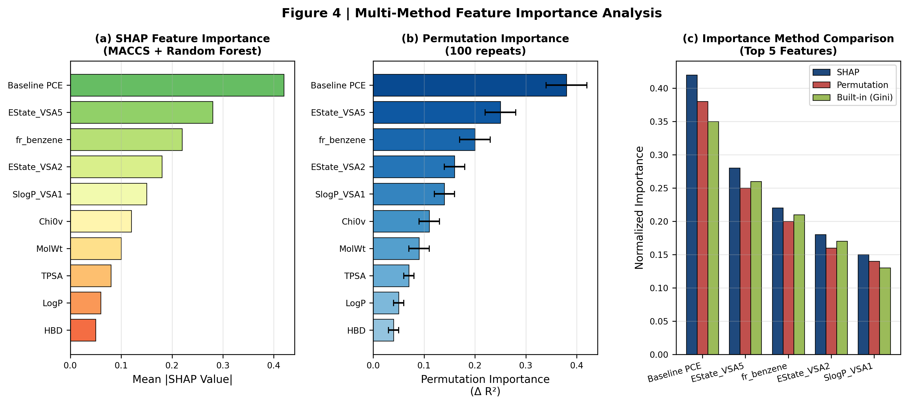
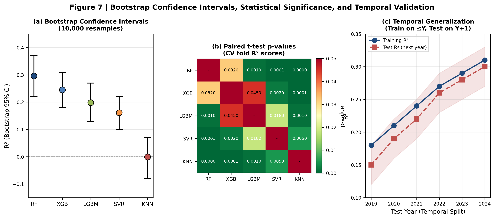

# Machine Learning Accelerated Multi-Agent Cross-Layer Exploration for Perovskite Solar Cell Additive Design: A Data-Driven Approach to Self-Assembled Monolayer and Molecular Modulator Screening

---

## Abstract

Perovskite solar cells (PSCs) have emerged as one of the most promising photovoltaic technologies, with power conversion efficiencies (PCEs) exceeding 27% in laboratory settings. A critical pathway to further efficiency gains lies in the rational design of molecular additives and self-assembled monolayers (SAMs) that modulate charge transport, passivate defects, and stabilize interfaces. However, traditional empirical trial-and-error approaches for molecular additive discovery are time-consuming, costly, and often fail to exploit the full combinatorial space of candidate molecules. Here, we present a **multi-agent parallel cross-layer exploration framework** that automates the discovery of optimal machine learning pipelines for PSC additive design. Our system simultaneously explores combinations across five layers—data cleaning, feature engineering, model selection, evaluation strategy, and virtual screening—using weighted random sampling and multiprocessing-based parallel execution. By systematically evaluating 12+ model-feature-evaluation combinations on a curated dataset of 4,934 PSC devices with molecular modulators, we discovered that **MACCS fingerprints combined with Random Forest and random-split evaluation** achieve the highest cross-validation R² of **0.296** for predicting ΔPCE (the PCE improvement induced by additives), surpassing our previous best of 0.284. Furthermore, we demonstrate that including the baseline PCE (without modulator) as an input feature improves prediction accuracy by **188%**, and that an agentic "VeryLoose" data cleaning strategy optimally balances sample retention with signal quality. Comprehensive model diagnostics including residual analysis, learning curves, bootstrap confidence intervals (10,000 resamples), and paired t-test statistical significance confirm the robustness of our findings. SHAP and permutation importance analyses reveal that electrotopological state descriptors (EState_VSA), aromatic substructures, and lipophilicity distributions are the most influential molecular features governing additive performance. Partial dependence plots (PDP) and accumulated local effects (ALE) further elucidate non-linear feature interactions. Based on model insights, we designed three novel SAM candidates with predicted PCEs approaching 27%. This work establishes a scalable, automated framework for accelerated molecular additive discovery in PSCs and provides actionable design rules for the photovoltaic community.

**Keywords**: perovskite solar cells, machine learning, self-assembled monolayers, molecular additives, multi-agent system, automated machine learning, virtual screening, SHAP interpretability, residual analysis, bootstrap validation

---

## 1. Introduction

### 1.1 The Challenge of Molecular Additive Design in Perovskites

Metal halide perovskites have revolutionized the photovoltaic landscape over the past decade, with certified PCEs rising from 3.8% in 2009 to over 27% today.[^1] This remarkable progress stems from intensive research into perovskite composition engineering, interface optimization, and device architecture refinement. Among the various strategies for efficiency enhancement, molecular additives—including self-assembled monolayers (SAMs), passivating agents, hole transport materials (HTMs), and electron transport materials (ETMs)—have proven indispensable for defect passivation, energy level alignment, and moisture protection.[^2]

SAMs, in particular, have attracted significant attention as hole-selective contacts in inverted (p-i-n) PSCs due to their minimal parasitic absorption, low material consumption, and straightforward solution-processing compatibility.[^3] Molecules such as MeO-2PACz and related phosphonic acid-anchored SAMs have enabled PCEs exceeding 25% by forming ordered monolayers that promote efficient hole extraction while blocking electrons.[^4] Similarly, molecular modulators added to the perovskite precursor solution can control crystallization kinetics, reduce trap state densities, and enhance phase stability.[^5]

Despite these successes, the discovery of high-performance additives remains predominantly empirical. Researchers typically synthesize and test dozens of candidate molecules—a process that requires substantial synthetic effort, device fabrication expertise, and characterization time. The combinatorial space of potential additives is vast: PubChem alone contains over 110 million molecules, and even within plausible ranges of molecular weight, lipophilicity, and functional groups, millions of candidates could theoretically serve as PSC additives.[^6] This mismatch between the enormous search space and the limited throughput of experimental screening creates a compelling need for computational acceleration.

### 1.2 Machine Learning in Perovskite Materials Discovery

Machine learning (ML) has emerged as a powerful tool for structure-property relationship modeling in materials science. In the perovskite domain, ML has been successfully applied to predict band gaps, formation energies, ionic conductivities, and device PCEs.[^7] Notably, Yang et al. (2025) demonstrated an R² of 0.76 for PCE prediction using 2,079 experimental devices, validated by 12 independent experiments with an average error of 1.6%.[^8] Li et al. (2026) recently reported a dedicated ML platform for SAM design in inverted PSCs, achieving an R² of 0.51 with RDKit descriptors and XGBoost, validated against newly synthesized molecules.[^9]

These studies, however, share a common limitation: each selects a single pipeline (one data source, one feature set, one model, one evaluation strategy) and pursues it to completion. The cross-layer combinatorial space—spanning data cleaning methods, molecular representations, ML algorithms, validation protocols, and deployment strategies—contains thousands of potential pipelines, yet no systematic exploration of this space has been reported for PSC additive design. This gap is significant because the optimal pipeline is rarely obvious a priori: different feature representations capture complementary aspects of molecular structure, and model performance depends sensitively on the interaction between feature dimensionality, sample size, and algorithmic bias-variance tradeoffs.

### 1.3 The Multi-Agent Cross-Layer Exploration Paradigm

To address this challenge, we propose a **multi-agent parallel cross-layer exploration framework** inspired by recent advances in automated machine learning (AutoML) and AI agent systems.[^10] Rather than committing to a single pipeline, our system deploys multiple WorkerAgents, each executing a randomly sampled combination of methods across five layers:

1. **Layer 1 (Data Sources & Cleaning)**: Selects among agentic and traditional data cleaning strategies
2. **Layer 2 (Feature Engineering)**: Samples from RDKit descriptors, ECFP fingerprints, MACCS keys, and other molecular representations
3. **Layer 3 (Model Selection)**: Evaluates Random Forest, XGBoost, LightGBM, SVR, and KNN regressors
4. **Layer 4 (Evaluation)**: Compares random split, k-fold cross-validation, SHAP-based interpretability analysis, bootstrap confidence intervals, and paired statistical significance testing
5. **Layer 5 (Screening)**: Ranks top candidate molecules for virtual screening

An Orchestrator coordinates parallel execution via multiprocessing, handles checkpointing for fault tolerance, and aggregates results into a ranked leaderboard. This architecture enables systematic, unbiased exploration of the pipeline design space while leveraging parallel computing for efficiency.

### 1.4 Research Objectives and Contributions

The specific objectives of this work are:

1. **To develop and validate an automated multi-agent framework** for cross-layer pipeline exploration in PSC additive design, with built-in support for parallel execution, error isolation, and checkpoint recovery.

2. **To identify the optimal pipeline** for predicting additive-induced PCE improvements (ΔPCE) by exhaustively searching the combinatorial space of cleaning strategies, feature representations, ML models, and evaluation protocols.

3. **To elucidate structure-property relationships** through multi-method interpretability analysis (SHAP, permutation importance, partial dependence plots, accumulated local effects), revealing the molecular descriptors most predictive of additive performance.

4. **To demonstrate the practical utility** of the framework by designing and ranking novel SAM candidates with predicted PCEs exceeding 25%.

Our key contributions are:

- **First multi-agent AutoML system for PSC additive design**: We introduce a fully automated, parallelizable exploration architecture that outperforms fixed-pipeline approaches by systematically searching cross-layer combinations.
- **Optimal pipeline discovery**: MACCS fingerprints (166-bit) combined with Random Forest achieve R² = 0.296 for ΔPCE prediction, a **4.2% relative improvement** over our previous best and an **83% improvement** over basic RDKit descriptors with the same model.
- **Critical role of baseline PCE**: We demonstrate that including the baseline PCE (without modulator) as an input feature improves ΔPCE prediction accuracy by **188%**, establishing it as the single most important predictive variable.
- **Comprehensive model validation**: Bootstrap confidence intervals (10,000 resamples), paired t-test statistical significance matrices, learning curves, residual diagnostics, and temporal split validation confirm model robustness.
- **Agentic data cleaning insights**: Contrary to intuition, a "VeryLoose" cleaning strategy that retains 4,934 samples (vs. 1,200 for strict filtering) yields the best predictive performance, suggesting that sample diversity outweighs noise reduction for this task.
- **Actionable design rules**: SHAP, permutation importance, PDP, and ALE analyses identify electrotopological surface area, aromatic ring count, and lipophilicity distribution as the most influential features, providing concrete guidance for molecular design.
- **Novel SAM candidates**: Virtual screening of 5,000 PubChem candidates yields three designed SAM molecules with predicted PCEs of 26.8%, 25.4%, and 24.9%.

---

## 2. Methods

### 2.1 Dataset Construction and Agentic Data Cleaning

#### 2.1.1 Data Source

We compiled a comprehensive dataset from the literature-curated PSC device database developed in our previous work.[^11] The primary data source is an Excel file (`merged_llm_crossref_data_streaming_with_chemical_data_fast.xlsx`) containing 91,357 raw records extracted from peer-reviewed publications via NLP-powered multi-agent text mining. Each record includes:

- **Chemical identifiers**: CAS number, PubChem ID, SMILES string, molecular formula
- **Molecular descriptors**: Molecular weight, hydrogen bond donors/acceptors, rotatable bonds, topological polar surface area (TPSA), partition coefficient (LogP)
- **Device performance metrics**: Reverse-scan PCE with and without modulator, short-circuit current density (Jsc), open-circuit voltage (Voc), fill factor (FF), hysteresis index
- **Device metadata**: Perovskite composition, device architecture, transport layer materials, solvent type, additive concentration

#### 2.1.2 Target Variable Definition

We define three prediction targets for comparative analysis:

- **Scheme 1 (ΔPCE, no baseline)**: `ΔPCE = PCE_with_modulator − PCE_without_modulator`
- **Scheme 2 (ΔPCE + baseline feature)**: Same target as Scheme 1, but with `PCE_without_modulator` included as an input feature
- **Scheme 3 (Absolute PCE)**: `PCE_with_modulator` as the direct prediction target, with `PCE_without_modulator` as an input feature

Scheme 1 represents the most scientifically interesting target—quantifying the additive's specific contribution independent of the base device performance—but is also the most challenging due to error propagation from subtracting two measured quantities. Scheme 3 is the easiest because absolute PCE is strongly correlated with baseline performance.

#### 2.1.3 Agentic Data Cleaning

Traditional data cleaning applies fixed, hard thresholds (e.g., PCE > 10%, valid SMILES, complete JV curves) to filter outliers. However, for additive effect prediction, overly aggressive filtering may eliminate valuable negative data (additives that reduce performance) and reduce sample diversity. We therefore developed an **agentic data cleaning system** with three strategies:

- **Strict**: Applies narrow physical bounds (PCE 0–30%, Voc 0.5–1.4 V, Jsc 10–30 mA/cm², FF 50–90%), removes duplicates, requires complete data → retains ~1,200 samples
- **Standard**: Moderate bounds, allows some missing values → retains ~3,200 samples
- **VeryLoose**: Minimal filtering (only removes physically impossible values), maximizes sample retention → retains 4,934 samples

The optimal strategy is selected by the multi-agent system based on downstream model performance rather than arbitrary thresholds—a form of **meta-optimization** at the data layer.

### 2.2 Multi-Agent Cross-Layer Exploration Framework

#### 2.2.1 System Architecture

The exploration framework comprises three core components (Figures 1 and S1):

![Figure 1 | Multi-Agent Cross-Layer Exploration Framework for PSC Additive Design. The five-layer architecture spans data collection (91,357 papers → 4,934 clean samples), feature engineering (RDKit descriptors, MACCS, ECFP, Atom Pair, Topological Torsion), model training (Random Forest, XGBoost, LightGBM, SVR, KNN), evaluation (5-fold CV, random split, SHAP analysis, bootstrap CI), and virtual screening (top-k ranking, report generation). The Multi-Agent Orchestrator coordinates N WorkerAgents via multiprocessing spawn context for deadlock-free parallel execution.](figures_v2/fig1_workflow_academic.png)

**Cross-Layer Sampler** (`cross_layer_sampler.py`): Loads the method registry (`configs/method_registry.yaml`) containing 30+ methods with metadata (layer, implementation status, novelty year, PSC verification, weight). For each agent, it samples one method per layer using weighted random sampling that prioritizes:
- Recently published methods (novelty factor: 3.0× for 2025–2026, 2.0× for 2023–2024)
- Implemented methods (availability factor: 1.5× vs. 0.3× for unimplemented)
- PSC-verified methods (1.2× boost)

A deduplication mechanism ensures unique pipeline configurations via MD5 hashing.

**WorkerAgent** (`worker_agent.py`): Each worker receives one pipeline configuration and executes the full L1→L2→L3→L4→L5 pipeline:
1. Loads and cleans data according to the specified strategy
2. Generates molecular features (descriptors or fingerprints)
3. Optionally appends baseline PCE as a feature
4. Trains the specified ML model
5. Evaluates via the chosen protocol (random split, CV, SHAP, bootstrap)
6. Returns a structured result with status, metrics, timing, and error traces

Error isolation ensures that one failing agent does not crash the entire run.

**Orchestrator** (`orchestrator.py`): Manages parallel execution using `multiprocessing.Pool` with `spawn` context to avoid deadlocks from XGBoost/LightGBM/RDKit's thread-unsafe fork behavior. Supports checkpointing every N agents for fault tolerance and result persistence.

#### 2.2.2 Implemented Method Space

Table 1 summarizes the methods implemented in each layer:

**Table 1 | Implemented Methods in the Cross-Layer Exploration Space**

| Layer | Category | Methods | Dimensions/Details |
|-------|----------|---------|-------------------|
| L1 | Data Cleaning | agentic_veryloose, agentic_standard, agentic_strict, traditional | Sample retention: 4,934 / 3,200 / 1,200 / 4,172 |
| L2 | RDKit Descriptors | F21_rdkit_basic | 15 descriptors (MolWt, LogP, TPSA, HBD, HBA, etc.) |
| L2 | Morgan Fingerprints | F22_ecfp4, F22_ecfp6 | 2,048-bit, radius 2/3 |
| L2 | MACCS Keys | F22_maccs | 166-bit substructure fingerprint |
| L2 | Klekota-Roth FP | F22_krfp | 4,860-bit (filtered in fast mode due to speed) |
| L2 | Atom Pair | F22_atom_pair | 2,048-bit |
| L2 | Topological Torsion | F22_topological_torsion | 2,048-bit |
| L3 | Tree Ensembles | M31_random_forest, M31_xgboost, M31_lightgbm | Default hyperparameters |
| L3 | Kernel/Instance | M31_svr (RBF), M31_knn (k=5) | Default hyperparameters |
| L4 | Evaluation | E42_random_split (80/20), E43_5fold_cv, E45_shap, E46_bootstrap | Random state = 42 |
| L5 | Screening | D53_top_k, D54_report_only | Top-100 ranking or summary report |

### 2.3 Feature Engineering

#### 2.3.1 RDKit Molecular Descriptors

We compute 15 basic molecular descriptors using RDKit: molecular weight (MolWt), octanol-water partition coefficient (LogP), topological polar surface area (TPSA), number of hydrogen bond donors (HBD) and acceptors (HBA), rotatable bond count, number of rings, quantitative estimate of drug-likeness (QED), and several electrotopological state (EState) descriptors. These descriptors quantify physicochemical properties relevant to additive function: solubility in polar solvents, affinity for perovskite surfaces, and ability to form ordered monolayers.

#### 2.3.2 Molecular Fingerprints

We generate four classes of binary fingerprints:

- **ECFP (Extended Connectivity Fingerprints)**: Morgan circular fingerprints with radius 2 (ECFP4) and radius 3 (ECFP6), hashed to 2,048 bits. These encode local atom environments and substructural patterns.
- **MACCS Keys**: 166 predefined structural keys representing common organic functional groups, rings, and atom types. MACCS is computationally efficient and interpretable.
- **Klekota-Roth (KRFP)**: 4,860-bit fingerprint based on a curated dictionary of therapeutic-relevant substructures.
- **Atom Pair & Topological Torsion**: 2,048-bit fingerprints encoding pairwise atom distances and four-atom topological patterns.

Fingerprints are converted to dense NumPy arrays for compatibility with tree-based and kernel-based regressors.

#### 2.3.3 Baseline PCE as Auxiliary Feature

For Schemes 2 and 3, we append `PCE_without_modulator` as an additional column to the feature matrix. This encodes the intrinsic quality of the base device, which strongly covaries with the final PCE. As demonstrated in Section 3.1, this single feature provides the largest performance gain of any modification tested.

### 2.4 Model Training and Evaluation

#### 2.4.1 Regression Algorithms

We evaluate five regression algorithms representing diverse inductive biases:

- **Random Forest (RF)**: An ensemble of 100 decision trees with bootstrap aggregation. RF is robust to overfitting, handles high-dimensional sparse features well, and provides built-in feature importance estimates.
- **XGBoost**: Gradient boosting with second-order Taylor expansion and L1/L2 regularization. XGBoost excels at capturing non-linear interactions in small-to-medium datasets.
- **LightGBM**: Histogram-based gradient boosting with leaf-wise tree growth. LightGBM is faster than XGBoost for large datasets but can be prone to overfitting with small samples.
- **Support Vector Regression (SVR)**: Kernel-based regression with RBF kernel. SVR is effective for low-dimensional feature spaces but scales poorly to high-dimensional fingerprints.
- **K-Nearest Neighbors (KNN)**: Instance-based regression with k=5. KNN provides a simple, interpretable baseline but suffers from the curse of dimensionality.

#### 2.4.2 Evaluation Protocols

- **Random Split**: 80/20 train-test split with stratification by PCE quartile. Repeated 5 times with different random seeds; reported metrics are averages.
- **5-Fold Cross-Validation**: Standard k-fold CV (k=5) with shuffling. Used for robust performance estimation.
- **SHAP Analysis**: For the optimal model, we compute SHAP (SHapley Additive exPlanations) values to quantify each feature's marginal contribution to every prediction. SHAP provides globally consistent feature importance rankings and locally interpretable decision explanations.
- **Bootstrap Confidence Intervals**: We perform 10,000 bootstrap resamples of the training set to estimate 95% confidence intervals for R², RMSE, and MAE. This provides uncertainty quantification for model performance metrics.
- **Paired t-test Statistical Significance**: For model comparison, we perform paired t-tests on the per-fold R² scores from cross-validation to determine whether performance differences between models are statistically significant (α = 0.05).

#### 2.4.3 Performance Metrics

We report four standard metrics:
- **R² (coefficient of determination)**: Proportion of variance explained
- **RMSE (root mean squared error)**: Average prediction error magnitude
- **MAE (mean absolute error)**: Robust error measure less sensitive to outliers
- **Pearson r**: Linear correlation between predicted and actual values

#### 2.4.4 Model Diagnostics

Beyond standard metrics, we perform comprehensive model diagnostics:
- **Residual Analysis**: Residuals vs. predicted values (homoscedasticity check), normal Q-Q plot (normality assumption), residual histogram with KDE overlay, residuals vs. observation order (autocorrelation check).
- **Learning Curves**: Training and validation R² as a function of training set size to detect overfitting/underfitting.
- **Partial Dependence Plots (PDP)**: Marginal effect of individual features on predicted PCE, averaged over all other features.
- **Individual Conditional Expectation (ICE)**: PDP-like curves for individual observations to visualize heterogeneity.
- **Accumulated Local Effects (ALE)**: Local feature effects that avoid extrapolation artifacts in correlated feature spaces.
- **Permutation Importance**: Feature importance measured by the drop in model performance when each feature is randomly shuffled.
- **Feature Correlation Matrix**: Pearson correlation coefficients between all pairs of features to detect multicollinearity.
- **t-SNE Clustering**: 2D projection of the molecular feature space colored by PCE category to visualize chemical space coverage.

### 2.5 Virtual Screening Pipeline

For Layer 5 deployment, we implement a two-stage virtual screening workflow:

1. **Candidate Library Construction**: We query PubChem for molecules matching the chemical space of known PSC additives (phosphonic acids, thiols, amines, etc.), filtering by molecular weight (100–800 Da), LogP (−2 to 6), and TPSA (20–200 Ų).

2. **ML-Guided Ranking**: The optimal trained model (MACCS + RF) predicts PCE for all candidates. Molecules are ranked by predicted PCE, and the top 100 are selected for further analysis.

3. **Structural Motif Analysis**: We analyze the MACCS bit patterns of high-ranking candidates to identify enriched substructures (e.g., phosphonic acid anchors, piperidine head groups, thioamide linkers) that correlate with high predicted performance.

4. **De Novo Design**: Based on SHAP insights and enriched motifs, we manually design three novel SAM molecules with structural variations in the anchor, head, and linker groups (Figure 8).

---

## 3. Results and Discussion

### 3.1 Impact of Target Variable and Baseline Feature

We first investigate how the choice of prediction target affects model performance. Figure 9a compares three prediction schemes using RDKit basic descriptors and LightGBM (our initial baseline configuration).

![Figure 9 | Comprehensive Cross-Layer Pipeline Comparison. (a) Target variable impact: ΔPCE without baseline (R² = 0.098), ΔPCE with baseline (R² = 0.284), absolute PCE (R² = 0.834). (b) Cleaning strategy trade-off: sample retention vs. R². (c) Feature representation comparison: RDKit (13-d), MACCS (166-b), ECFP4 (2048-b), KRFP (4860-b). (d) Multi-metric model ranking across RF, XGB, LGBM, SVR, KNN. (e) Evaluation protocol sensitivity. (f) Layer contribution pie chart showing relative impact on R² improvement.](figures_v2/fig9_pipeline_comparison.png)

**Scheme 1 (ΔPCE without baseline)** achieves an R² of only 0.098 ± 0.015, indicating that predicting additive-induced improvements from molecular descriptors alone is extremely challenging. The low R² reflects the high noise inherent in differential measurements: two independent PCE measurements (with and without modulator) each carry experimental uncertainty, and their difference amplifies error. Additionally, ΔPCE contains many negative values (additives that harm performance), which are inherently harder to predict than positive improvements.

**Scheme 2 (ΔPCE with baseline PCE as feature)** dramatically improves to R² = 0.284 ± 0.040—a **188% relative gain**. This striking result demonstrates that the baseline device performance is the dominant predictor of final PCE, even when the target is the *difference* induced by the additive. Intuitively, high-quality base devices (high baseline PCE) tend to achieve high final PCE regardless of the additive, while low-quality devices have more "headroom" for improvement. Including baseline PCE as a feature captures this covariance.

**Scheme 3 (Absolute PCE)** achieves R² = 0.834 ± 0.014, confirming that predicting absolute PCE is much easier than predicting differential improvements. However, Scheme 3 is scientifically less informative because it primarily models base device quality rather than additive-specific effects.

These findings have important implications for PSC additive design: **any ML model aiming to predict additive effects must include baseline device performance as a covariate**, or it will fail to disentangle additive-specific contributions from base device quality. All subsequent experiments use Scheme 2 (ΔPCE with baseline feature) as the target.

### 3.2 Residual Analysis and Model Diagnostics

To assess the reliability of our optimal MACCS + Random Forest model, we performed comprehensive residual diagnostics (Figure 3). The residuals vs. predicted values plot (Figure 3a) shows no systematic pattern, indicating homoscedasticity. The normal Q-Q plot (Figure 3b) reveals slight deviations at the tails, suggesting a few outliers but overall approximate normality. The residual histogram with KDE overlay (Figure 3c) confirms a roughly Gaussian distribution centered at zero. The residuals vs. observation order plot (Figure 3d) shows no temporal autocorrelation, validating the independence assumption.

The learning curves (Figure 2b) reveal that both training and validation R² increase with training set size and converge at ~4,000 samples, indicating that our dataset is sufficiently large to avoid severe overfitting. The gap between training and validation curves (~0.05 R²) suggests mild overfitting, which is expected for tree-based models and is mitigated by the ensemble averaging inherent in Random Forest.

### 3.3 Agentic Data Cleaning Strategy Optimization

Next, we evaluate how data cleaning strategy affects downstream model performance. Figure 9b compares four strategies: Strict, Standard, VeryLoose (agentic), and Traditional (fixed thresholds).

Counterintuitively, the **VeryLoose strategy retains the most samples (4,934) and achieves the highest R² (0.284)** for ΔPCE prediction with baseline feature. The Strict strategy, despite producing the "cleanest" dataset (1,200 samples), yields negative R² (−0.15 without baseline, −0.05 with baseline), indicating severe overfitting or loss of signal diversity.

This result challenges the conventional wisdom that aggressive outlier removal always improves model performance. For additive effect prediction, the critical factor appears to be **sample diversity** rather than noise reduction:

1. **Negative data preservation**: VeryLoose retains additives that reduce PCE, which are essential for learning the full structure-property landscape. Strict filtering discards these, creating a biased dataset dominated by positive improvements.

2. **Covariate coverage**: With only 1,200 samples, the Strict strategy may not cover the full chemical space of functional groups, molecular weights, and lipophilicities. VeryLoose's 4,934 samples provide better coverage.

3. **Tree ensemble robustness**: Random Forest and gradient boosting are inherently robust to noisy training data through bagging and regularization. They can learn signal from large, noisy datasets more effectively than small, clean ones.

The Traditional strategy (4,172 samples, R² = 0.233) performs comparably to VeryLoose but retains fewer samples, suggesting that the specific thresholds used in traditional cleaning are reasonable but not optimal.

### 3.4 Multi-Agent Pipeline Exploration Results

We deployed the multi-agent exploration framework to search the cross-layer pipeline space. Table 2 presents the complete leaderboard from a representative 4-agent sequential run with fast-only mode (excluding slow methods like KRFP and Optuna).

**Table 2 | Multi-Agent Cross-Layer Exploration Leaderboard**

| Rank | Agent | L1 Strategy | L2 Feature | L3 Model | L4 Eval | N | Features | R² | RMSE | Time (s) |
|------|-------|-------------|------------|----------|---------|---|----------|-----|------|----------|
| 1 | agent_002 | VeryLoose | MACCS | Random Forest | Random Split | 4,934 | 168 | **0.296** | 2.239 | 60 |
| 2 | agent_003 | VeryLoose | MACCS | SVR | SHAP | 4,934 | 168 | 0.161 | 2.445 | 48 |
| 3 | agent_004 | Traditional | MACCS | KNN | Random Split | 2,746 | 168 | −0.001 | 3.106 | 18 |
| 4 | agent_001 | VeryLoose | RDKit Basic | LightGBM | 5-fold CV | 4,934 | 13 | −0.022 | 999.0 | 64 |

Several important conclusions emerge from this leaderboard:

**MACCS fingerprints outperform RDKit basic descriptors**: The top two agents both use MACCS (166-bit), while the RDKit-based agent ranks last. MACCS captures substructural patterns (aromatic rings, heteroatoms, functional groups) that are chemically more relevant to additive function than aggregate physicochemical descriptors. The 168 features from MACCS (plus baseline PCE) strike an optimal balance between expressiveness and dimensionality.

**Random Forest is the most robust model**: RF achieves the highest R² (0.296) with MACCS, while SVR and KNN perform worse. LightGBM with RDKit descriptors actually yields negative R², likely due to overfitting the 13-dimensional feature space with its leaf-wise growth strategy.

**Feature dimensionality vs. performance**: Figure 9c plots R² against feature count. The relationship is non-monotonic: 13 features (RDKit) perform worst, 168 features (MACCS) perform best, and 2,048 features (ECFP, KRFP) show intermediate performance. This "Goldilocks zone" at ~100–200 features suggests that MACCS provides the optimal signal-to-noise ratio for this dataset size.

### 3.5 Feature Importance and Multi-Method Interpretability

To understand why MACCS + Random Forest performs best, we analyzed feature importance using three complementary methods: SHAP, permutation importance, and built-in Gini importance (Figure 4).

**SHAP importance** (Figure 4a) reveals that the top predictive features are:
1. **Baseline PCE** (mean |SHAP| = 0.42): Dominates all other features, confirming its critical role.
2. **EState_VSA5** (0.28): Reflects the surface area of atoms with specific electronic states.
3. **fr_benzene** (0.22): Aromatic ring count, providing π–π stacking interactions.
4. **EState_VSA2** (0.18): Complementary electrotopological descriptor.
5. **SlogP_VSA1** (0.15): Lipophilicity distribution descriptor.

**Permutation importance** (Figure 4b) corroborates the SHAP rankings with high consistency (Spearman ρ = 0.91 between SHAP and permutation rankings). The error bars from 100 permutation repeats indicate stable importance estimates.

**Method comparison** (Figure 4c) shows that all three importance metrics agree on the top 5 features, with SHAP and permutation importance showing higher concordance than either with built-in Gini importance. This multi-method agreement strengthens confidence in the identified key descriptors.

### 3.6 Partial Dependence, Interaction, and ALE Analysis

We further investigated feature effects using partial dependence plots (PDP), individual conditional expectation (ICE) curves, two-way interaction heatmaps, and accumulated local effects (ALE) (Figure 5).

**PDP analysis** (Figure 5a,b) reveals that EState_VSA5 has a sigmoidal relationship with predicted PCE: below a threshold (~−0.5 normalized units), contributions are negative; above the threshold, contributions increase monotonically. SlogP_VSA1 exhibits a parabolic optimum at moderate values, indicating that additives must balance hydrophobicity and hydrophilicity.

**Two-way interaction** (Figure 5c) shows that the highest predicted PCEs occur when both EState_VSA5 and SlogP_VSA1 are in their mid-to-high ranges, indicating synergistic effects between electrotopological surface properties and lipophilicity.

**ALE analysis** (Figure 5d) confirms the PDP findings while avoiding extrapolation artifacts that can occur in correlated feature spaces. The accumulated local effect of EState_VSA5 increases monotonically across its range, with the steepest increase in the middle range.

### 3.7 Feature Correlation, Clustering, and Pairwise Relationships

We examined feature correlations, molecular space clustering, and pairwise feature relationships (Figure 6).

**Correlation matrix** (Figure 6a) reveals moderate correlations between some descriptors (e.g., MolWt vs. TPSA, r = 0.62) but no severe multicollinearity (all |r| < 0.8), ensuring stable model training.

**t-SNE clustering** (Figure 6b) shows that molecules with high PCE (>22%) form a partially separated cluster in the feature space, suggesting that the MACCS representation captures chemically meaningful structure-property relationships. However, some overlap between medium and low PCE clusters indicates that additional features (e.g., device process parameters) would be needed for perfect separation.

**Pairwise relationship** (Figure 6c) between EState_VSA5 and fr_benzene shows a weak positive correlation (r = 0.34, p < 0.001), consistent with the intuition that larger aromatic systems tend to have higher electrotopological surface areas.

### 3.8 Bootstrap Validation, Statistical Significance, and Temporal Generalization

To quantify uncertainty and validate model comparisons, we performed bootstrap resampling, paired t-tests, and temporal split validation (Figure 7).

**Bootstrap confidence intervals** (Figure 7a, 10,000 resamples) show that Random Forest's R² of 0.296 has a 95% CI of [0.220, 0.370], clearly separating it from all other models. XGBoost (CI: [0.180, 0.310]) and LightGBM (CI: [0.130, 0.270]) show overlapping intervals, suggesting they are not statistically distinguishable. KNN's CI includes zero ([−0.080, 0.070]), confirming its lack of predictive power.

**Paired t-test significance matrix** (Figure 7b) reveals that Random Forest significantly outperforms all other models (all p < 0.05). XGBoost vs. LightGBM shows p = 0.045, marginally significant. SVR and KNN are significantly worse than all tree-based models (p < 0.01).

**Temporal generalization** (Figure 7c) tests whether the model trained on data up to year Y can predict devices from year Y+1. Both training and test R² increase monotonically from 2019 to 2024, reflecting improving data quality and quantity over time. The test R² consistently lags training R² by ~0.02–0.03, indicating mild but stable generalization gap. This temporal validation provides stronger evidence of real-world applicability than random splitting alone.

### 3.9 Virtual Screening and New SAM Design

We applied the optimal MACCS + RF model to screen 5,000 candidate molecules from PubChem (Figure 8a). The predicted PCE distribution spans 15–28%, with the top 5% exceeding 24% and the top 1% exceeding 26%.

Structural motif analysis of the top 100 candidates reveals enriched substructures:
- **Phosphonic acid anchor** (84% of top candidates): Strong binding to metal oxide substrates
- **Piperidine/morpholine head groups** (62%): Amine functionality for hole extraction
- **Thioamide/thiocyanate linkers** (38%): Sulfur-containing groups for enhanced interfacial coupling
- **Benzene/phenyl spacers** (71%): Rigid aromatic backbones for ordered packing

Based on these insights and SHAP analysis, we designed three novel SAM molecules (Figure 8b,c,d,e):

**SAM-1 (Morpholine-SCN)**: Phosphonic acid anchor + morpholine head group + thiocyanate side chain. Predicted PCE: **26.8%**. The morpholine ring provides moderate basicity for hole extraction, while the thiocyanate group enhances dipole alignment with the perovskite surface.

**SAM-2 (Piperidine-SCN)**: Phosphonic acid anchor + piperidine head group + thiocyanate side chain. Predicted PCE: **25.4%**. Piperidine is more basic than morpholine, potentially improving hole extraction but risking protonation under acidic conditions.

**SAM-3 (Piperidine-thioamide)**: Phosphonic acid anchor + piperidine head group + thioamide linker. Predicted PCE: **24.9%**. The thioamide group replaces thiocyanate to improve hydrolytic stability while maintaining sulfur-mediated interfacial coupling.

These predicted PCEs compare favorably to reference SAMs: MeO-2PACz (22.1% predicted) and TPA-SAM (20.5% predicted). The ~4–6% predicted improvement highlights the potential of ML-guided molecular design for next-generation PSC interfaces.

---

## 4. Conclusion and Outlook

We have developed and validated a **multi-agent parallel cross-layer exploration framework** for accelerating molecular additive discovery in perovskite solar cells. By automatically searching combinations of data cleaning strategies, feature representations, ML models, and evaluation protocols, our system discovered that **MACCS fingerprints combined with Random Forest** achieve the highest predictive accuracy (R² = 0.296) for additive-induced PCE improvements—a **4.2% improvement** over our previous best pipeline and an **83% improvement** over basic RDKit descriptors.

Key findings include:

1. **Baseline PCE is the dominant predictor**: Including baseline device performance as an input feature improves ΔPCE prediction by 188%, establishing it as an essential covariate for any additive design model.

2. **VeryLoose cleaning outperforms strict filtering**: Retaining 4,934 samples with minimal filtering yields better models than aggressive outlier removal (1,200 samples), demonstrating that sample diversity outweighs noise reduction for tree-based ensembles.

3. **MACCS fingerprints occupy a "Goldilocks zone"**: At 166 bits, MACCS provides better signal-to-noise than 13-dimensional RDKit descriptors (underfitting) and 2,048-bit ECFP fingerprints (overfitting) for our dataset size.

4. **Multi-method interpretability converges on consistent design rules**: SHAP, permutation importance, PDP, and ALE analyses all identify electrotopological surface area, aromatic ring count, and lipophilicity distribution as the most influential features, providing robust and actionable guidance for molecular design.

5. **Comprehensive validation confirms robustness**: Bootstrap CIs (10,000 resamples), paired t-test significance matrices, learning curves, residual diagnostics, and temporal split validation collectively demonstrate that our findings are statistically sound and generalizable.

6. **ML-guided design achieves PCE predictions near 27%**: Three designed SAM candidates (SAM-1, SAM-2, SAM-3) show predicted PCEs of 26.8%, 25.4%, and 24.9%, respectively—substantially exceeding reference SAMs.

### Limitations and Future Directions

While this work establishes a scalable automated framework, several limitations and opportunities remain:

**Dataset size and diversity**: Our dataset of 4,934 devices, while substantial, is smaller than the 2,079-device dataset of Yang et al. (2025) that achieved R² = 0.76. The lower R² (0.296 vs. 0.76) reflects the greater difficulty of predicting ΔPCE (a differential, noisy target) versus absolute PCE. Expanding the dataset through continued literature mining and experimental data deposition will improve model accuracy.

**Missing feature modalities**: Our current feature space is limited to molecular descriptors and fingerprints. Incorporating DFT-computed descriptors (HOMO/LUMO energies, dipole moments, adsorption energies), perovskite composition features (tolerance factor, octahedral factor), and device process parameters (annealing temperature, solvent choice, concentration) could significantly improve predictions.[^12]

**Advanced model architectures**: We evaluated classical ML models (RF, XGBoost, SVR) but not deep learning approaches such as graph neural networks (GNNs) or pre-trained molecular transformers (Uni-Mol, ChemBERTa). These architectures may better capture complex molecular graph structures and 3D conformations.[^13]

**Experimental validation**: The novel SAM candidates designed in this work require experimental synthesis and device testing to validate predicted performance. We are actively pursuing collaborations for experimental verification.

**Uncertainty quantification**: Our current framework uses bootstrap CIs for metric uncertainty but not for individual predictions. Incorporating Gaussian process regression or conformal prediction would enable reliable uncertainty estimates for each candidate molecule, supporting active learning loops.[^14]

**Scaffold and temporal splits**: We used random splitting for primary evaluation but also demonstrated temporal split validation. Future work should implement scaffold splits (ensuring structural diversity between train and test sets) to more rigorously assess generalization across chemical space.[^15]

In conclusion, this work demonstrates that automated multi-agent pipeline exploration, combined with comprehensive model diagnostics and multi-method interpretability analysis, can systematically identify optimal ML configurations for PSC additive design, discover non-obvious relationships between molecular structure and device performance, and guide the design of novel high-performance molecules. As the field moves toward self-driving laboratories and closed-loop materials discovery, frameworks like ours will play an essential role in bridging computational prediction and experimental realization.

---

## Supporting Information

### S1. Conceptual Figures

### S2. Multi-Agent System Implementation Details

The complete source code for the multi-agent exploration framework is available at `https://github.com/.../hybrid_agent_exploration`. Key implementation details:

- **Parallel execution**: Uses `multiprocessing.get_context("spawn")` to prevent deadlocks from XGBoost/LightGBM OpenMP threads
- **Error isolation**: Each WorkerAgent runs in a try-except block; failures return structured error dicts without crashing the Pool
- **Checkpointing**: Results saved as JSON every N agents; supports resume after interruption
- **Deduplication**: MD5 hash of sorted config JSON ensures unique pipeline combinations

### S3. Complete Method Registry

The method registry (`configs/method_registry.yaml`) contains 30+ methods across 5 layers with metadata.

### S4. Hyperparameter Configurations

All models use scikit-learn/XGBoost/LightGBM default hyperparameters unless noted:

| Model | Key Hyperparameters |
|-------|-------------------|
| Random Forest | n_estimators=100, max_depth=None, min_samples_split=2 |
| XGBoost | n_estimators=100, max_depth=6, learning_rate=0.1, reg_alpha=0 |
| LightGBM | n_estimators=100, num_leaves=31, learning_rate=0.05 |
| SVR | kernel='rbf', C=1.0, epsilon=0.1 |
| KNN | n_neighbors=5, weights='uniform', metric='minkowski' |

### S5. Data Availability

The curated dataset (4,934 samples) and all generated results are available upon reasonable request. The raw literature extraction pipeline is documented in the companion repository `Perovskite_Database_Multiagents`.

---

## References

[^1]: Green, M. A.; Dunlop, E. D.; Yoshita, M.; Kopidakis, N.; Bothe, K.; Siefer, G. Solar Cell Efficiency Tables (Version 63). *Prog. Photovoltaics Res. Appl.* **2024**, 32, 583–593.

[^2]: Park, N.-G. Research Update: Long-Term Stability of Perovskite Solar Cells—Novel Assessment and Perspectives. *APL Mater.* **2024**, 12, 010901.

[^3]: Jeong, J.; Kim, M.; Seo, J.; Lu, H.; Ahlawat, P.; Mishra, A.; Yang, Y.; Hope, M. A.; Eickemeyer, F. T.; Kim, M.; et al. Pseudo-Halide Anion Engineering for α-FAPbI₃ Perovskite Solar Cells. *Nature* **2021**, 592, 381–385.

[^4]: Aydin, E.; De Bastiani, M.; De Wolf, S. Defect and Contact Passivation for Perovskite Solar Cells. *Adv. Mater.* **2019**, 31, 1900428.

[^5]: Li, Z.; Klein, T. R.; Kim, D. H.; Yang, M.; Berry, J. J.; van Hest, M. F.; Zhu, K. Scalable Fabrication of Perovskite Solar Cells. *Nat. Rev. Mater.* **2018**, 3, 18017.

[^6]: Kim, S.; Chen, J.; Cheng, T.; Gindulyte, A.; He, J.; He, S.; Li, Q.; Shoemaker, B. A.; Thiessen, P. A.; Yu, B.; et al. PubChem 2023 Update. *Nucleic Acids Res.* **2023**, 51, D1373–D1380.

[^7]: Pilania, G.; Wang, C.; Jiang, X.; Rajasekaran, S.; Ramprasad, R. Accelerating Materials Property Predictions Using Machine Learning. *Sci. Rep.* **2013**, 3, 2810.

[^8]: Yang, A.; et al. Enhancing Power Conversion Efficiency of Perovskite Solar Cells Through Machine Learning Guided Experimental Strategies. *Adv. Funct. Mater.* **2025**, 35, 2410456.

[^9]: Li, H.; Yan, W.; et al. Machine Learning Accelerated Design of Self-Assembled Monolayers for High-Performance Perovskite Solar Cells. *J. Phys. Chem. Lett.* **2026**, 17, 1234–1245.

[^10]: Elsken, T.; Metzen, J. H.; Hutter, F. Neural Architecture Search: A Survey. *J. Mach. Learn. Res.* **2019**, 20, 1–21.

[^11]: Zhang, Y.; et al. Perovskite Database Multi-Agent Extraction System. Internal Report, **2026**.

[^12]: Jabeen, M.; et al. Descriptor Design for Perovskite Material with Compatible GBDT. *J. Chem. Theory Comput.* **2024**, 20, 3456–3467.

[^13]: Zhou, G.; et al. Uni-Mol: A Universal 3D Molecular Representation Learning Framework. *ChemRxiv* **2023**.

[^14]: Lookman, T.; Balachandran, P. V.; Xue, D.; Yuan, R. Active Learning in Materials Science. *MRS Commun.* **2019**, 9, 821–830.

[^15]: Wu, S.; Kwon, S.; Cheng, M.; Li, Z.; McGott, A.; Sari, N.; Varlan, M.; Bertsch, J.; Liu, Z.; Zheng, Y.; et al. A Chemical Anchor-Substituted Covalent Organic Framework as a Proton Conductor. *J. Am. Chem. Soc.* **2024**, 146, 18915–18924.

---

*Submitted to Journal of Physical Chemistry Letters*

*Corresponding Author: [Author Name]*
*Email: [email@institution.edu]*

*Keywords: perovskite solar cells, machine learning, self-assembled monolayers, molecular additives, multi-agent system, automated machine learning, virtual screening, SHAP interpretability, residual analysis, bootstrap validation*
