# Pipeline Architecture — 钙钛矿ML文献图谱：从固定工作流到AI Agent自主探索

> 核心观点：现有文献多是单一路线（数据→表征→模型→评估→筛选），AI Agent 的价值不是替代模型，而是自动探索和调试跨层组合路径，并把数据库、DFT、代码、实验和新数据回流连接成闭环。

---

## Mermaid 主图

```mermaid
flowchart TB

%% =======================
%% Main title
%% =======================
TITLE["钙钛矿机器学习文献图谱：从固定工作流到 AI Agent 自主探索<br/>Perovskite ML literature map: data → representation → model → evaluation → screening / discovery"]:::title

%% =======================
%% Layer 5
%% =======================
subgraph L5["第5层：部署、虚拟筛选与自主发现<br/>Deployment / virtual screening / autonomous discovery"]
direction LR
D51["预测目标<br/>PCE, Voc, Jsc, FF<br/>稳定性, 寿命, band gap<br/>缺陷钝化, 界面能级, 迁移率"]:::deploy
D52["虚拟筛选库<br/>PubChem / ZINC / ChEMBL<br/>商业可购买库<br/>Sigma-Aldrich, TCI, Aladdin<br/>Enamine, eMolecules, Mcule"]:::deploy
D53["输出候选<br/>分子添加剂 / 钝化剂<br/>HTM / ETM / SAM<br/>A/B/X 组分<br/>溶剂与工艺配方"]:::deploy
D54["实验与计算闭环<br/>DFT 验证<br/>器件制备与表征<br/>稳定性测试<br/>新数据回流"]:::deploy
D55["AI Agent / SDL<br/>自动规划 → 调用工具<br/>运行 → 评估 → 反思<br/>迭代优化"]:::agent
end

%% =======================
%% Layer 4
%% =======================
subgraph L4["第4层：评估、验证与优化策略<br/>Evaluation / validation / search strategy"]
direction LR
E41["任务类型<br/>回归: PCE, band gap, lifetime<br/>分类: stable / unstable, valid / invalid<br/>排序: top-k candidates"]:::eval
E42["数据划分<br/>random split<br/>scaffold split<br/>composition split<br/>temporal split<br/>external test"]:::eval
E43["交叉验证<br/>5-fold / 10-fold CV<br/>nested CV<br/>repeated seeds<br/>leave-one-family-out"]:::eval
E44["超参数搜索<br/>Optuna / TPE<br/>Bayesian optimization<br/>grid / random search<br/>early stopping"]:::eval
E45["模型可信度<br/>R2, RMSE, MAE<br/>AUROC, F1, hit rate<br/>uncertainty<br/>SHAP / feature importance"]:::eval
end

%% =======================
%% Layer 3
%% =======================
subgraph L3["第3层：机器学习模型<br/>Machine learning models"]
direction LR
M31["经典机器学习<br/>Random Forest<br/>XGBoost / LightGBM<br/>SVR / KNN<br/>Elastic Net / Ridge / Lasso"]:::model
M32["深度学习<br/>MLP / DNN<br/>CNN for images or spectra<br/>GNN / MPNN<br/>CGCNN / MEGNet"]:::model
M33["预训练分子模型<br/>Uni-Mol<br/>MolCLR<br/>ChemBERTa<br/>MolFormer"]:::model
M34["生成模型<br/>VAE / JTVAE<br/>diffusion / flow<br/>molecular generation<br/>scaffold-constrained generation"]:::model
M35["主动学习与代理模型<br/>Gaussian process<br/>Bayesian optimization<br/>multi-objective BO<br/>active learning"]:::model
M36["迁移与多任务<br/>transfer learning<br/>multi-task learning<br/>domain adaptation<br/>few-shot / low-data learning"]:::model
end

%% =======================
%% Layer 2
%% =======================
subgraph L2["第2层：数据分析与表征<br/>Representations / descriptors / features"]
direction LR
F21["分子描述符<br/>RDKit<br/>Mordred<br/>PaDEL<br/>donor number, HBA/HBD, LogP"]:::feature
F22["分子指纹<br/>Morgan / ECFP<br/>MACCS<br/>KRFP<br/>substructure fingerprints"]:::feature
F23["DFT / 量化特征<br/>HOMO / LUMO<br/>band gap, dipole<br/>ESP, charge<br/>adsorption / formation energy"]:::feature
F24["钙钛矿组分特征<br/>A/B/X composition<br/>ionic radius<br/>tolerance factor<br/>octahedral factor<br/>electronegativity"]:::feature
F25["器件与工艺特征<br/>architecture: n-i-p / p-i-n<br/>transport layers<br/>solvent, annealing<br/>additive concentration<br/>initial PCE"]:::feature
F26["学习型表示<br/>SMILES token<br/>molecular graph embedding<br/>crystal graph<br/>JTVAE latent<br/>Uni-Mol 3D embedding"]:::feature
F27["图像 / 谱学表征<br/>PL / TRPL / UV-vis<br/>XRD / GIWAXS<br/>SEM / AFM<br/>in situ PL / reflection"]:::feature
end

%% =======================
%% Layer 1
%% =======================
subgraph L1["第1层：数据来源<br/>Data sources"]
direction LR
S11["文献与人工整理数据<br/>PSC device tables<br/>JV / EQE / stability<br/>additive / passivator reports<br/>negative data if available"]:::data
S12["钙钛矿公共数据库<br/>Perovskite Database Project<br/>PerovskiteDB<br/>Materials Project<br/>NOMAD / OQMD / JARVIS"]:::data
S13["文本挖掘数据<br/>NLP from papers<br/>fabrication details<br/>device stack extraction<br/>自动结构化实验条件"]:::data
S14["计算数据<br/>DFT / MD<br/>high-throughput calculation<br/>SCAPS / drift-diffusion<br/>in-house simulation"]:::data
S15["化学分子库<br/>PubChem<br/>ChEMBL<br/>ZINC<br/>DrugBank-like molecules"]:::data
S16["可购买分子库<br/>Sigma-Aldrich / TCI<br/>Aladdin / Energy Chemical<br/>Enamine / eMolecules / Mcule<br/>supplier availability"]:::data
S17["自动化实验数据<br/>robotic synthesis<br/>blade coating / slot-die<br/>in situ PL / imaging<br/>self-driving lab logs"]:::data
end

%% =======================
%% Traditional single-path literature
%% =======================
subgraph TPATH["传统文献模式：通常只选择一条固定路线"]
direction TB
T1["选一个数据集"]:::trad
T2["选一类特征<br/>例如 RDKit 或 DFT"]:::trad
T3["选一个模型<br/>例如 RF / XGBoost / SVR"]:::trad
T4["选一个评估方式<br/>例如 5-fold CV"]:::trad
T5["得到一个筛选列表"]:::trad
T1 --> T2 --> T3 --> T4 --> T5
end

%% =======================
%% AI Agent search panel
%% =======================
subgraph AG["AI Agent 自主探索模式：跨层组合搜索"]
direction TB
A0["科学目标定义<br/>maximize PCE / stability<br/>minimize cost / toxicity<br/>ensure purchasability"]:::agent
A1["Planner<br/>拆分任务与设计搜索空间"]:::agent
A2["Retriever<br/>检索文献, 数据库, 代码, 历史实验"]:::agent
A3["Feature Agent<br/>自动生成 RDKit / DFT / fingerprint / embedding"]:::agent
A4["Model Agent<br/>自动尝试 RF, XGBoost, GNN, Uni-Mol, BO"]:::agent
A5["Evaluation Agent<br/>nested CV, scaffold split, uncertainty, SHAP"]:::agent
A6["Executor / Debugger<br/>运行代码, 修复报错, 记录版本"]:::agent
A7["Experiment / DFT Agent<br/>生成 CP2K / Gaussian / 实验配方"]:::agent
A8["Memory<br/>失败路径, 成功路径, 新数据回流"]:::agent
A0 --> A1 --> A2 --> A3 --> A4 --> A5 --> A6 --> A7 --> A8 --> A1
end

%% =======================
%% Bottleneck and thesis
%% =======================
B0["过去为什么很难穷举组合？<br/>1. 数据源 × 特征 × 模型 × 评估的组合空间巨大<br/>2. DFT, RDKit, 深度模型, 实验数据格式不兼容<br/>3. 超参数与数据清洗成本高<br/>4. 小样本 PSC 数据容易过拟合与泄漏<br/>5. 计算, 实验, 文献三条链路难以闭环"]:::bottleneck

B1["核心观点<br/>现有文献多是单一路线：数据 → 表征 → 模型 → 评估 → 筛选<br/>AI Agent 的价值不是替代模型，而是自动探索和调试跨层组合路径，<br/>并把数据库、DFT、代码、实验和新数据回流连接成闭环。"]:::thesis

%% =======================
%% Main upward arrows
%% =======================
TITLE --> D55
S12 --> F24
S15 --> F21
S16 --> F22
S14 --> F23
S17 --> F27

F21 --> M31
F22 --> M31
F23 --> M35
F24 --> M32
F25 --> M31
F26 --> M33
F26 --> M34
F27 --> M32

M31 --> E43
M32 --> E45
M33 --> E43
M34 --> E41
M35 --> E44
M36 --> E42

E41 --> D51
E42 --> D53
E43 --> D53
E44 --> D52
E45 --> D54

D54 --> S11
D55 --> AG
AG --> B1
B0 --> AG

%% =======================
%% AI Agent cross-layer exploration
%% =======================
A2 -. data search .-> S11
A2 -. database search .-> S12
A2 -. molecule library .-> S15
A3 -. feature generation .-> F21
A3 -. quantum descriptors .-> F23
A3 -. learned embedding .-> F26
A4 -. model selection .-> M31
A4 -. foundation model .-> M33
A4 -. active learning .-> M35
A5 -. validation design .-> E42
A5 -. uncertainty .-> E45
A7 -. experiment or DFT .-> D54
A8 -. new data .-> S17

%% =======================
%% Traditional comparison links
%% =======================
TPATH -. contrast .-> B0
TPATH -. fixed pipeline .-> B1

%% =======================
%% Styles
%% =======================
classDef title fill:#ffffff,stroke:#111827,stroke-width:2px,color:#111827,font-weight:bold;
classDef data fill:#eaf3ff,stroke:#2563eb,stroke-width:1.5px,color:#0f172a;
classDef feature fill:#ecfdf5,stroke:#16a34a,stroke-width:1.5px,color:#0f172a;
classDef model fill:#fff7ed,stroke:#ea580c,stroke-width:1.5px,color:#0f172a;
classDef eval fill:#f5f3ff,stroke:#7c3aed,stroke-width:1.5px,color:#0f172a;
classDef deploy fill:#fef2f2,stroke:#dc2626,stroke-width:1.5px,color:#0f172a;
classDef agent fill:#eff6ff,stroke:#0284c7,stroke-width:2px,color:#0f172a,font-weight:bold;
classDef trad fill:#f3f4f6,stroke:#6b7280,stroke-width:1.3px,color:#111827;
classDef bottleneck fill:#fff1f2,stroke:#be123c,stroke-width:2px,color:#111827;
classDef thesis fill:#fffbeb,stroke:#d97706,stroke-width:2px,color:#111827,font-weight:bold;
```



---

## 传统方法 vs AI Agent 对比

### 传统单一路径（虚线）

```
Paper A: PerovskiteDB → RDKit描述符 → RF → 5-fold CV → 候选列表
Paper B: 文献数据 → DFT特征 → XGBoost → nested CV → ZINC筛选
Paper C: 实验数据 → ECFP → SVR → random split → PubChem筛选
```

### AI Agent 自主探索（实线跨层连接）

Agent 不走固定路线，而是根据科学目标自主决定探索方向：
- `Retriever` 自动搜索多个数据源
- `Feature Agent` 自动尝试不同表征组合（RDKit + Uni-Mol embedding）
- `Model Agent` 自动对比多种模型（XGBoost vs Uni-Mol vs BO）
- `Evaluation Agent` 自动选择合适的验证策略（scaffold split + uncertainty）
- `Memory` 记录成功/失败路径，指导下一次迭代
- `Experiment Agent` 将筛选结果回流到DFT或实验验证

---

## 过去为什么很难穷举组合？

1. **数据源 × 特征 × 模型 × 评估的组合空间巨大**
2. **DFT, RDKit, 深度模型, 实验数据格式不兼容**
3. **超参数与数据清洗成本高**
4. **小样本 PSC 数据容易过拟合与泄漏**
5. **计算, 实验, 文献三条链路难以闭环**

AI Agent 的核心价值：**不是替代某个模型，而是把过去难以兼容的组合空间自动化搜索起来，连接成闭环。**
