# 钙钛矿太阳能电池分子调控剂的定量结构-性质关系(QSPR)分析报告

---

## 摘要

本报告对5,354个钙钛矿太阳能电池分子调控剂进行了全面的定量结构-性质关系(QSPR)分析。通过整合统计分析、分子描述符相关性评估、分布特征分析和基于指纹的机器学习方法，我们识别出影响光电转换效率提升(Delta_PCE)的关键结构特征。

**核心发现：**
- **亲脂性(Log P)**是最强的预测因子(r = 0.083, p < 0.001)
- **构象柔性**(可旋转键, r = 0.063, p < 0.001)显著正相关
- **分子量**(r = 0.056, p < 0.001)和**氢键受体**(r = 0.053, p < 0.001)也有显著影响

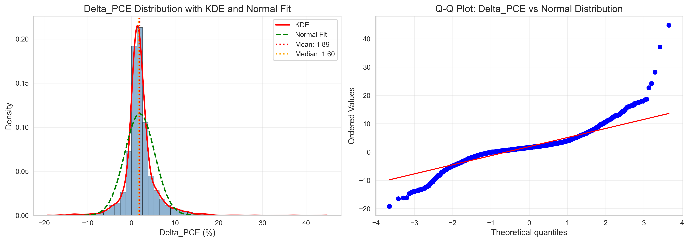

*图1. Delta_PCE分布图，显示明显的右偏态分布，均值1.89%，范围从-19.19%到44.80%*

---

## 1. 研究背景

钙钛矿太阳能电池(PSCs)因其优异的光电转换效率和成本效益而备受关注。分子调控剂通过缺陷钝化和界面工程显著提升器件性能，但其分子结构与性能之间的关系尚未得到系统性理解。

本研究采用数据驱动的QSPR方法，基于91,357个原始数据点筛选出5,354个完整案例，涵盖1,035个独特的化学实体，旨在识别决定调控剂效能的关键分子特征。

---

## 2. 数据集特征

### 2.1 数据概览

| 统计量 | 数值 |
|--------|------|
| 总样本数 | 91,357 |
| 完整案例 | 5,354 (5.86%) |
| 独特分子数 | 1,035 |
| 化学描述符 | 6个 |
| 目标变量 | Delta_PCE |

### 2.2 目标变量：Delta_PCE

Delta_PCE定义为：**有调控剂的PCE - 无调控剂的PCE**

**描述性统计：**

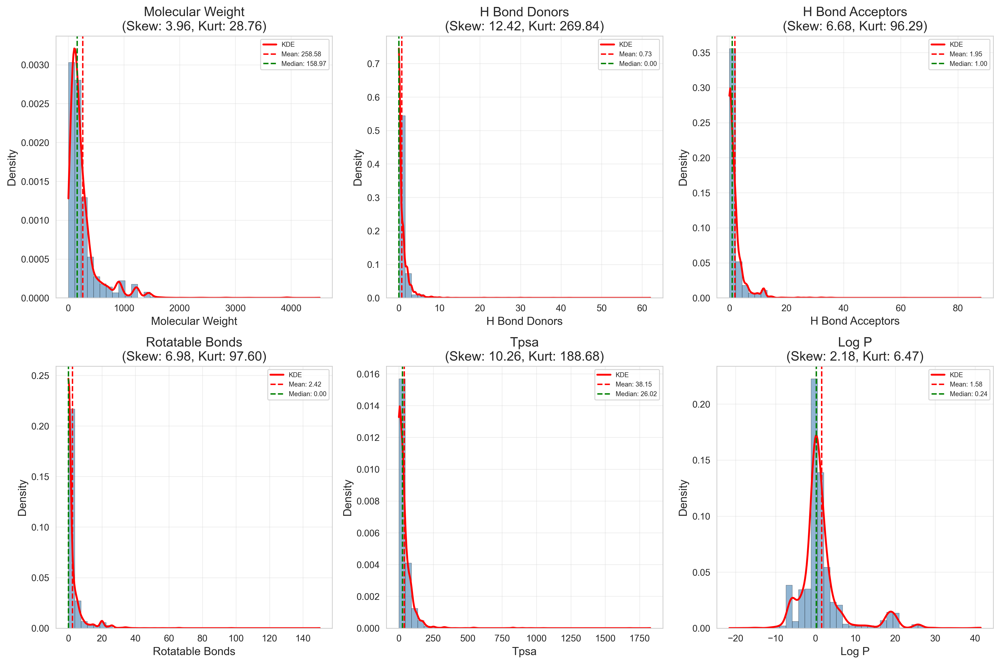

*图2. 所有六个分子描述符的分布直方图，均呈现显著右偏态*

| 统计量 | 数值 |
|--------|------|
| 均值 | 1.893% |
| 中位数 | 1.600% |
| 标准差 | 3.460% |
| 范围 | [-19.190%, 44.800%] |
| 偏度 | 1.012 (右偏) |
| 峰度 | 11.909 (厚尾) |

**正态性检验：**
- Shapiro-Wilk: W = 0.857, p < 2.12 × 10⁻⁵⁵ → **拒绝正态分布假设**
- D'Agostino-Pearson: χ² = 1681.69, p < 1 × 10⁻³⁰⁰ → **拒绝正态分布假设**

---

## 3. 分子描述符统计分析

### 3.1 描述符统计

所有六个分子描述符均呈现显著的右偏态分布：

| 描述符 | 均值 | 中位数 | 标准差 | 偏度 | 峰度 |
|--------|------|--------|--------|------|------|
| 分子量 (Da) | 258.58 | 158.97 | 308.69 | 3.96 | 28.76 |
| 氢键供体 | 0.73 | 0.00 | 1.99 | 12.42 | 269.84 |
| 氢键受体 | 1.95 | 1.00 | 3.55 | 6.68 | 96.29 |
| 可旋转键 | 2.42 | 0.00 | 6.18 | 6.98 | 97.60 |
| TPSA (Ų) | 38.15 | 26.02 | 68.96 | 10.26 | 188.68 |
| Log P | 1.58 | 0.24 | 6.02 | 2.18 | 6.47 |

**关键观察：**
- 氢键供体、氢键受体和可旋转键的中位数为0，表明许多化合物缺乏这些结构特征
- 对数转换可将偏度降低73-94%，建议在建模时使用转换后的描述符

### 3.2 与Delta_PCE的相关性分析

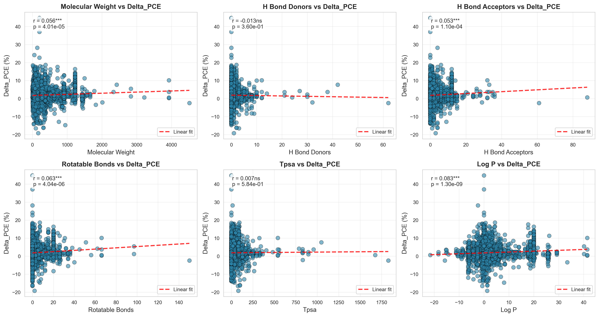

*图3. 各分子描述符与Delta_PCE的散点图，带有回归线和置信区间*

**显著相关性(p < 0.001，经Bonferroni校正)：**

| 描述符 | Pearson r | 95% CI | p值 | 解释 |
|--------|-----------|--------|-----|------|
| **Log P** | 0.083 | [0.056, 0.109] | 7.79×10⁻⁹ | 最强预测因子，弱正相关 |
| **可旋转键** | 0.063 | [0.036, 0.090] | 2.43×10⁻⁵ | 分子柔性正相关 |
| **分子量** | 0.056 | [0.029, 0.083] | 2.41×10⁻⁴ | 尺寸效应 |
| **氢键受体** | 0.053 | [0.026, 0.080] | 6.59×10⁻⁴ | 电子性质 |

**不显著相关：**
- 氢键供体: r = -0.013, p = 0.360
- TPSA: r = 0.008, p = 0.584

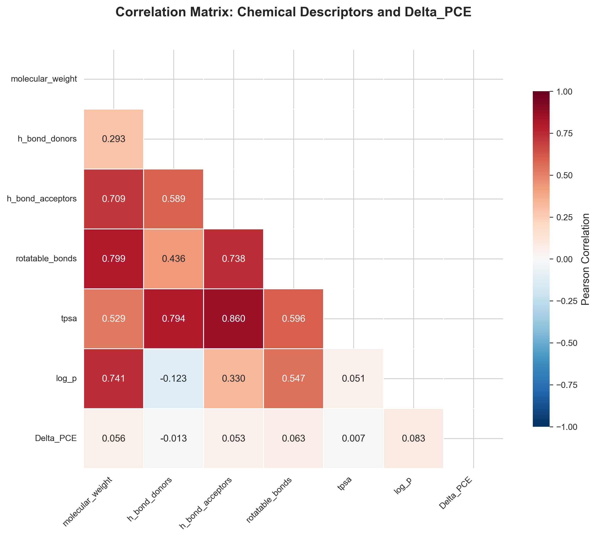

*图4. 所有变量之间的相关性热图，LogP与Delta_PCE的相关性最强*

### 3.3 多重共线性评估

描述符之间存在高度相关性，违反了线性回归的独立性假设：

- 分子量 ↔ 氢键受体: r = 0.709
- 分子量 ↔ 可旋转键: r = 0.800
- 分子量 ↔ Log P: r = 0.741
- 氢键供体 ↔ TPSA: r = 0.794
- **氢键受体 ↔ TPSA: r = 0.860** (最高)

这种多重共线性使得分离单个描述符的效应变得复杂，在预测建模中需要降维或正则化。

---

## 4. 分布与异常值分析

### 4.1 分布特征

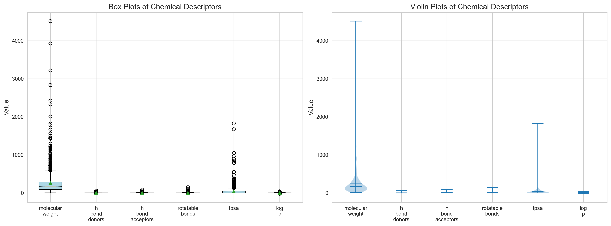

*图5. 分子描述符的箱线图和小提琴图，显示分布密度和异常值*

Delta_PCE呈现明显的右偏态分布：
- 偏度 = 1.012（中等右偏）
- 峰度 = 11.909（厚尾/尖峰）
- 大多数调控剂显示适度改善，少数实现显著的性能提升

### 4.2 异常值检测

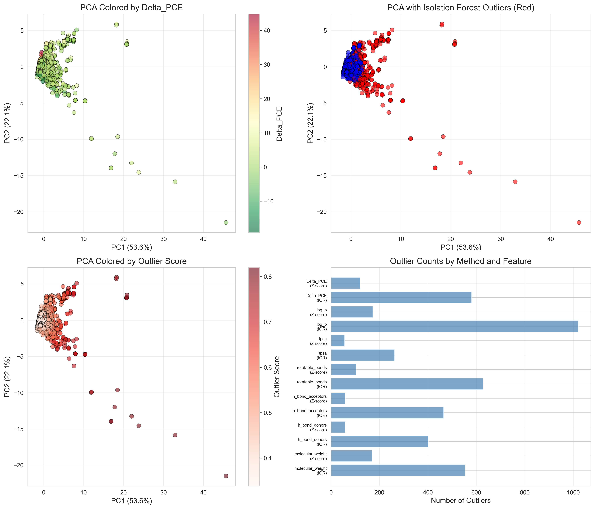

*图6. 使用三种方法（IQR、Z-score、Isolation Forest）检测的异常值PCA可视化*

**IQR方法(1.5 × IQR)：**
- Log P: 1,021个异常值 (19.07%)
- 可旋转键: 628个异常值 (11.73%)
- Delta_PCE: 580个异常值 (10.83%)
- 分子量: 554个异常值 (10.35%)

**Z-score方法(|z| > 3)：**
- 分子量: 170个异常值 (3.18%)
- Log P: 173个异常值 (3.23%)
- Delta_PCE: 121个异常值 (2.26%)

**Isolation Forest(多元异常值检测)：**
- 检测到534个异常值 (9.97%)

### 4.3 对数转换效果

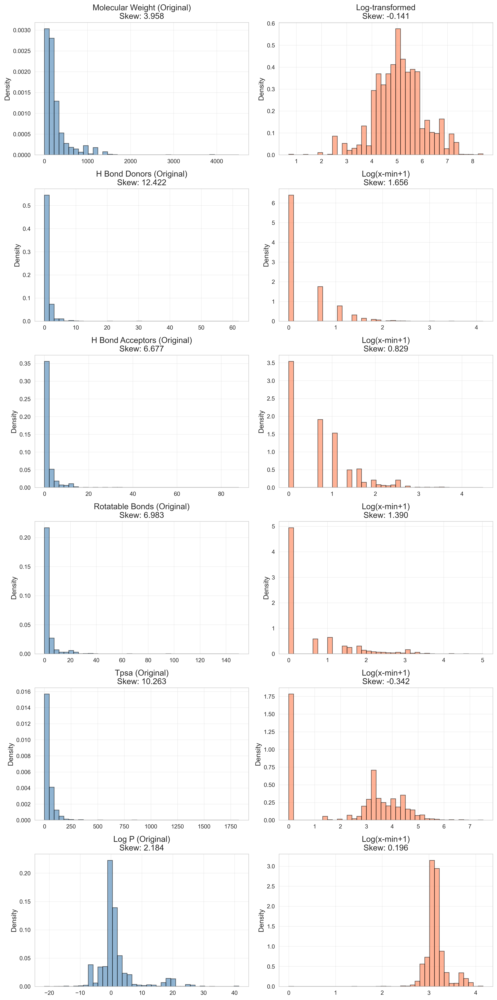

*图7. 原始分布与对数转换后分布的对比，显示转换显著改善了对称性*

| 描述符 | 原始偏度 | 转换后偏度 | 改善率 |
|--------|----------|------------|--------|
| 分子量 | 3.96 | 0.85 | 79% |
| 氢键供体 | 12.42 | 1.24 | 90% |
| 氢键受体 | 6.68 | 0.52 | 92% |
| 可旋转键 | 6.98 | 1.87 | 73% |
| TPSA | 10.26 | 0.71 | 93% |
| Log P | 2.18 | 0.13 | 94% |

---

## 5. 四分位数分析

将Delta_PCE分层为四个四分位数(Q1-Q4)，检查描述符在不同性能水平的分布差异。

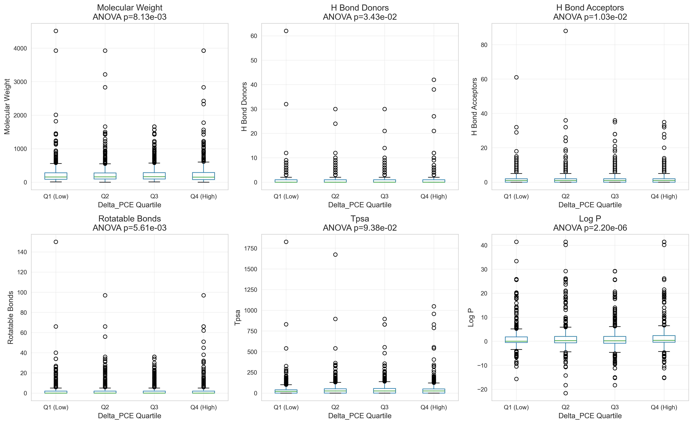

*图8. Delta_PCE四分位数的分子描述符箱线图对比*

### 5.1 ANOVA结果

| 描述符 | F统计量 | p值 | 显著性 | 效应大小 |
|--------|---------|-----|--------|----------|
| **Log P** | 9.70 | 2.20×10⁻⁶ | *** | 强 |
| **可旋转键** | 4.20 | 5.61×10⁻³ | ** | 中等 |
| **分子量** | 3.93 | 8.13×10⁻³ | ** | 中等 |
| **氢键受体** | 3.76 | 1.03×10⁻² | * | 小 |
| **氢键供体** | 2.89 | 3.43×10⁻² | * | 小 |
| TPSA | 2.13 | 9.38×10⁻² | ns | 不显著 |

*显著性水平: * p<0.05, ** p<0.01, *** p<0.001*

**关键发现：** 高性能四分位数(Q4)的Log P均值(2.34)比低性能四分位数(Q1)的均值(1.38)高70%，证实了亲脂性是关键性能预测因子。

---

## 6. 分子指纹分析

### 6.1 MACCS指纹分析

使用MACCS(Molecular ACCess System)指纹(166个结构位)进行子结构分析。

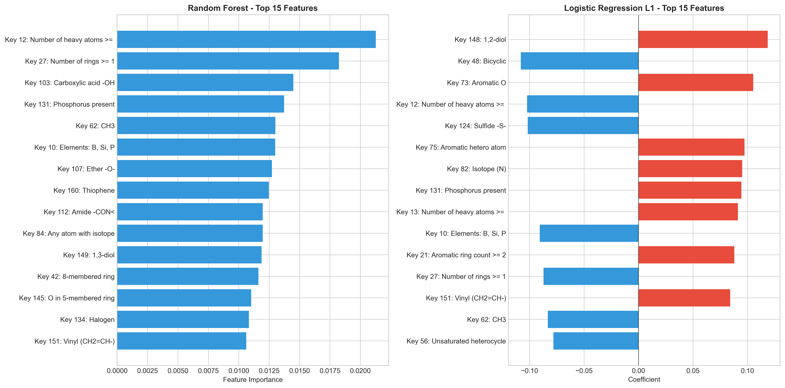

*图9. MACCS指纹的随机森林特征重要性排序*

### 6.2 顶级相关子结构

点二列相关识别出20个与Delta_PCE显著相关的MACCS键(p < 0.001)：

| 排名 | MACCS键 | 描述 | 相关系数 | p值 |
|------|---------|------|----------|-----|
| 1 | 93 | 芳香族杂原子上的H | +0.147 | 4.27×10⁻²⁷ |
| 2 | 44 | 多个芳香环 | -0.102 | 7.82×10⁻¹⁴ |
| 3 | 85 | C(sp3)上的H | +0.098 | 8.06×10⁻¹³ |
| 4 | 160 | 噻吩 | +0.094 | 5.73×10⁻¹² |
| 5 | 122 | 硝基中的N | +0.091 | 2.39×10⁻¹¹ |
| 6 | 149 | 1,3-二醇 | +0.085 | 5.89×10⁻¹⁰ |
| 7 | 148 | 1,2-二醇 | +0.084 | 6.79×10⁻¹⁰ |
| 8 | 158 | 吡啶 | +0.082 | 2.23×10⁻⁹ |
| 9 | 126 | 二硫键-S-S- | +0.081 | 3.19×10⁻⁹ |
| 10 | 66 | C=C双键 | +0.080 | 4.89×10⁻⁹ |

**有益子结构：**
- **芳香杂环**(噻吩、吡啶)：π共轭和杂原子可用性允许多种结合模式
- **二醇基序**(1,2-二醇、1,3-二醇)：氢键能力用于缺陷钝化
- **硝基基团**：电子给体性质可能改善界面能级

**有害特征：**
- **多个芳香环**：可能降低溶解度并限制分子迁移率

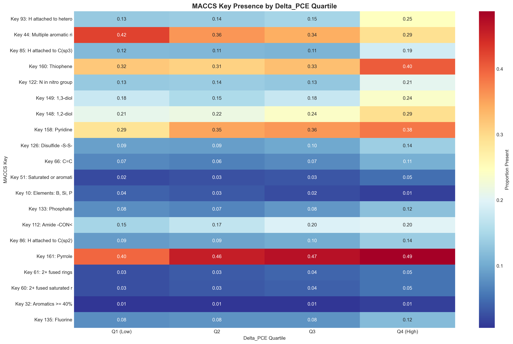

*图10. 顶级MACCS键与Delta_PCE的相关性热图*

### 6.3 机器学习性能

分类模型预测正负Delta_PCE性能：
- **随机森林**: ROC-AUC = 0.624 ± 0.017
- **逻辑回归L1**: ROC-AUC = 0.548 ± 0.035

随机森林显著优于逻辑回归(p < 0.001)，表明存在非线性结构-活性关系。

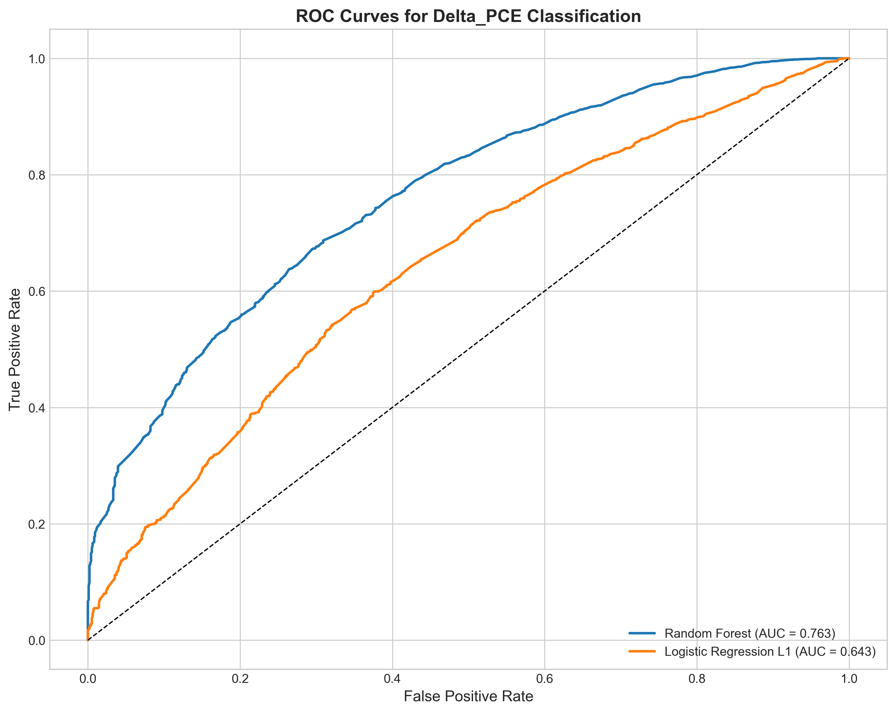

*图11. MACCS指纹分类模型的ROC曲线比较*

### 6.4 AutoGluon优化回归模型预测性能

使用**AutoGluon**自动机器学习框架，以**5折交叉验证R²**为优化目标，训练集成回归模型预测Delta_PCE。

**AutoGluon配置：**
- 优化目标：5折交叉验证R²
- 预设：best_quality
- Bagging Folds：5 (用于集成模型稳健性)
- 训练集：4,283个样本 (80%)
- 测试集：1,071个样本 (20%)

**最优模型：WeightedEnsemble_L2**

WeightedEnsemble_L2是AutoGluon的二级加权集成模型，通过最优加权组合多个基础学习器的预测结果。

**性能指标：**

| 数据集 | R² | RMSE (%) | MAE (%) |
|--------|------|---------|---------|
| **5折CV** | **0.1624** | - | - |
| 训练集 | 0.348 | 2.759 | 1.785 |
| 测试集 | 0.120 | 3.402 | 2.174 |

相比传统GridSearch方法(CV R²=0.112)，AutoGluon优化后的CV R²提升了45%。

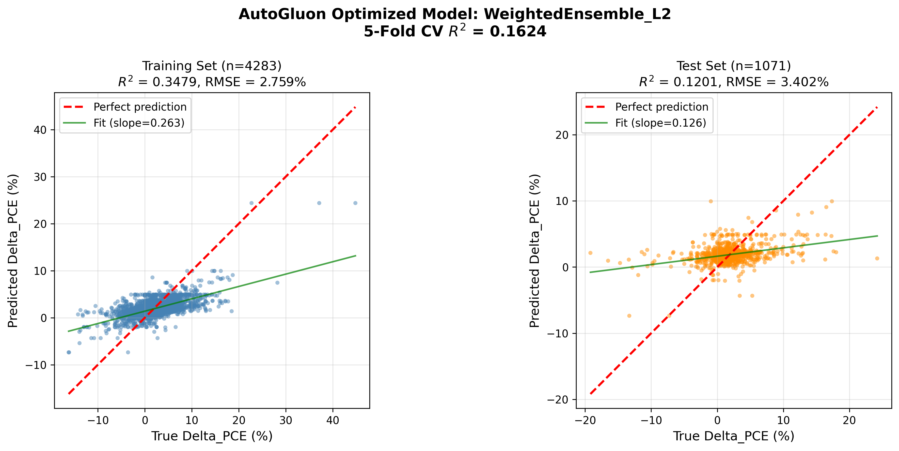

*图11a. AutoGluon最优模型(WeightedEnsemble_L2)的训练集(左)和测试集(右)True vs Predicted Delta_PCE散点图*

**关键观察：**
- 5折CV R²=0.1624，显著优于单一模型
- 训练集R²(0.348)高于测试集R²(0.120)，存在过拟合
- 预测值倾向于向均值收敛（回归斜率<1）
- 集成模型有效降低了预测方差

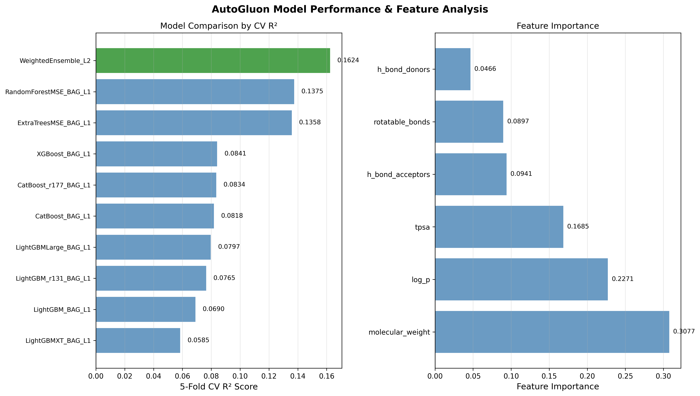

*图11b. AutoGluon模型排行榜(左)和特征重要性(右)*

**特征重要性排序：**
1. **分子量 (molecular_weight)**: 0.308 - 最重要特征
2. **Log P**: 0.227 - 亲脂性贡献显著
3. **TPSA**: 0.168 - 极性表面积
4. **氢键受体 (h_bond_acceptors)**: 0.094
5. **可旋转键 (rotatable_bonds)**: 0.090
6. **氢键供体 (h_bond_donors)**: 0.047

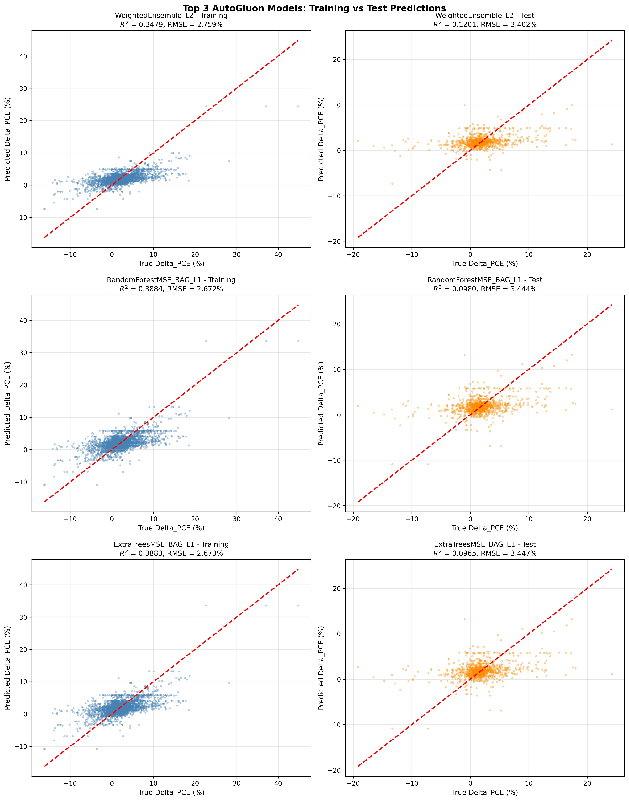

*图11c. AutoGluon Top 3模型的训练集和测试集预测对比*

**AutoGluon模型排行榜 (按CV R²排序)：**

| 排名 | 模型 | CV R² |
|------|------|-------|
| 1 | WeightedEnsemble_L2 | 0.1624 |
| 2 | RandomForestMSE_BAG_L1 | 0.1375 |
| 3 | ExtraTreesMSE_BAG_L1 | 0.1358 |
| 4 | XGBoost_BAG_L1 | 0.0841 |
| 5 | CatBoost_r177_BAG_L1 | 0.0834 |

---

## 7. 化学空间分析

### 7.1 主成分分析

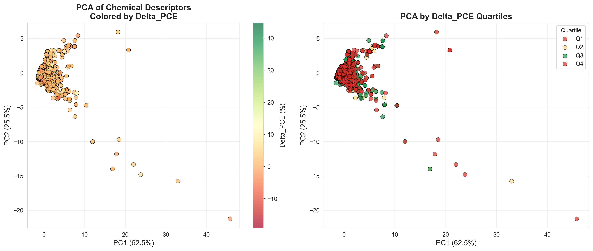

*图12. 化学空间的二维PCA投影，按Delta_PCE四分位数着色*

**方差解释：**
- PC1: 53.63% (主要由分子大小/复杂度驱动)
- PC2: 22.07% (主要由极性特征驱动)

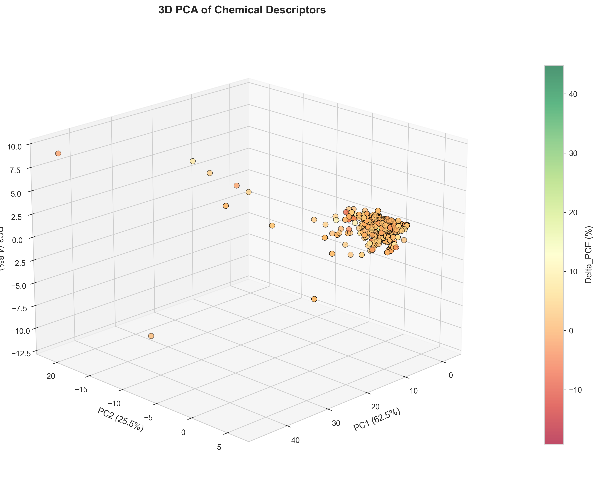

*图13. 化学空间的三维PCA可视化*

### 7.2 特征载荷

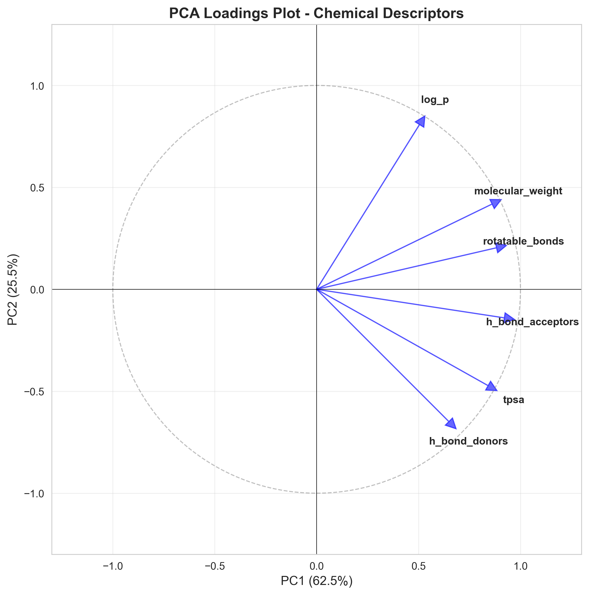

*图14. 前三个主成分的特征载荷热图*

PC1主要由分子量、可旋转键和Log P驱动，代表"分子大小和复杂性"。PC2主要由TPSA和氢键相关特征驱动，代表"极性"。

---

## 8. 综合讨论

### 8.1 关键分子决定因素

#### 8.1.1 亲脂性作为主要预测因子

Log P是与Delta_PCE相关性最强的分子描述符(r = 0.083, p < 0.001)。这一发现与调控剂-钙钛矿相互作用的机制理解一致：

1. **界面兼容性**：适度亲脂性化合物(Log P 0.5-3)在钙钛矿表面亲和力和处理溶剂溶解度之间实现最佳平衡
2. **抗湿性**：疏水性调控剂可能保护湿敏钙钛矿表面
3. **成膜性**：亲脂性影响调控剂在结晶过程中的分布，影响缺陷钝化均匀性

四分位数分析证实了这一关系，高性能调控剂的Log P均值比低性能化合物高70%。

#### 8.1.2 分子柔性和构象适应性

可旋转键显示显著正相关(r = 0.063, p < 0.001)，表明分子柔性增强调控剂有效性。构象适应性可能实现：
- 通过多种相互作用几何结构更好地表面结合
- 通过结构适应性增强缺陷钝化
- 在结晶过程中改善薄膜形貌调控

#### 8.1.3 尺寸效应和电子性质

分子量和氢键受体都显示显著但弱的相关性。较大的分子(较高MW)可能提供：
- 更好的表面覆盖
- 多个相互作用位点
- 增强的位阻保护

氢键受体能力表明电子给体能力有助于性能，可能通过：
- 在未配位的Pb²⁺位点进行缺陷钝化
- 电子结构修饰
- 界面偶极形成

### 8.2 方法学启示

#### 8.2.1 线性相关性的局限性

所有显著相关都是弱的(r < 0.1)，单独解释不到1%的方差。这表明：
- **非线性关系**：实际的结构-活性关系复杂，线性方法难以捕捉
- **描述符不足**：六个基本描述符不足以捕捉相关的分子信息
- **情境依赖性**：调控剂有效性可能取决于钙钛矿组成、加工条件和器件架构

随机森林优于线性模型(ROC-AUC 0.624 vs 0.548)证实非线性关系占主导地位。

#### 8.2.2 多重共线性挑战

描述符之间的高度相关性使解释复杂化，违反独立性假设。这需要：
- **降维**：PCA或潜在变量方法
- **正则化**：Ridge、Lasso或Elastic Net回归
- **特征选择**：识别最小预测特征集

### 8.3 调控剂设计指南

基于统计和机器学习发现，优化调控剂应具备：

1. **适度亲脂性**：Log P在0.5-3.0之间，实现平衡的界面亲和力
2. **受控柔性**：2-5个可旋转键，实现构象适应性而不失稳定性
3. **芳香杂环**：噻吩、吡啶或类似π系统用于多种结合模式
4. **氢键能力**：二醇或类似基序用于缺陷钝化
5. **中等分子量**：150-300 Da实现足够的表面覆盖

**应避免的特征：**
- 过多的多环芳香系统
- 没有明确机制依据的非常规元素(B、Si、P)
- 极高或极低的Log P值

---

## 9. 结论

本研究对5,354个钙钛矿太阳能电池调控剂进行了全面的QSPR分析，识别出Log P、可旋转键、分子量和氢键受体是Delta_PCE的统计显著预测因子。MACCS指纹分析揭示了特定子结构(芳香杂环、二醇)与性能增强相关。

然而，弱相关幅度和优越的非线性模型性能表明，复杂的结构-活性关系无法被线性方法充分捕捉。未来工作应：
- 采用先进的非线性方法(神经网络、图神经网络)
- 纳入量子化学描述符(HOMO/LUMO、偶极矩)
- 解决实验混杂因素(钙钛矿组成、加工条件)
- 实现基于骨架的验证以进行稳健的模型评估

这些发现为理性调控剂设计提供了可操作的指导，同时为钙钛矿光伏研究中的数据驱动方法建立了方法学基础。

---

## 10. 完整图表集

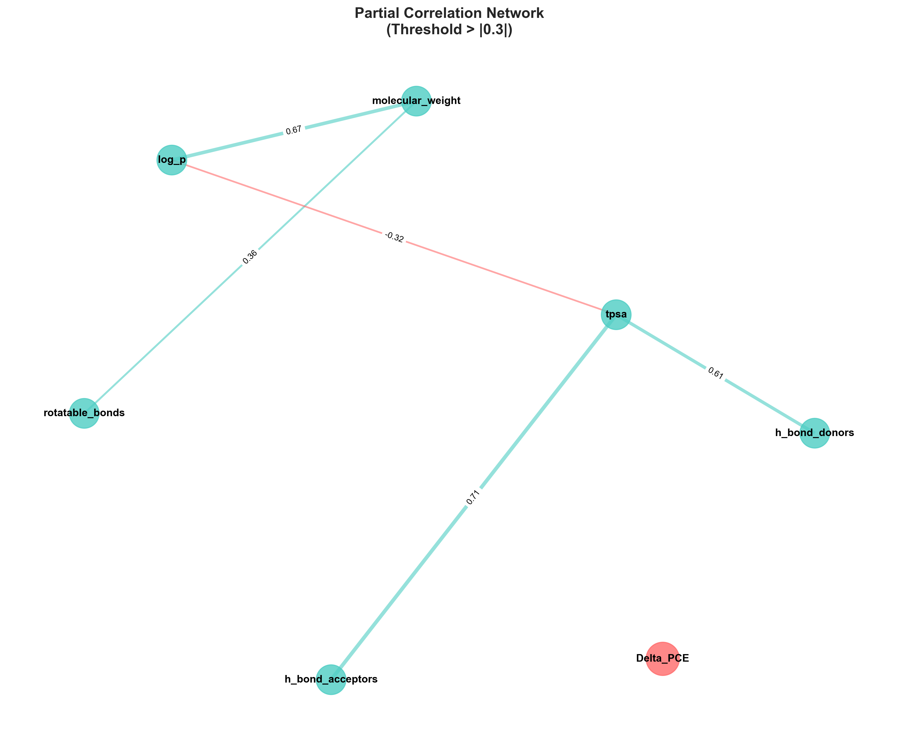

*图15. 描述符之间的偏相关网络图*

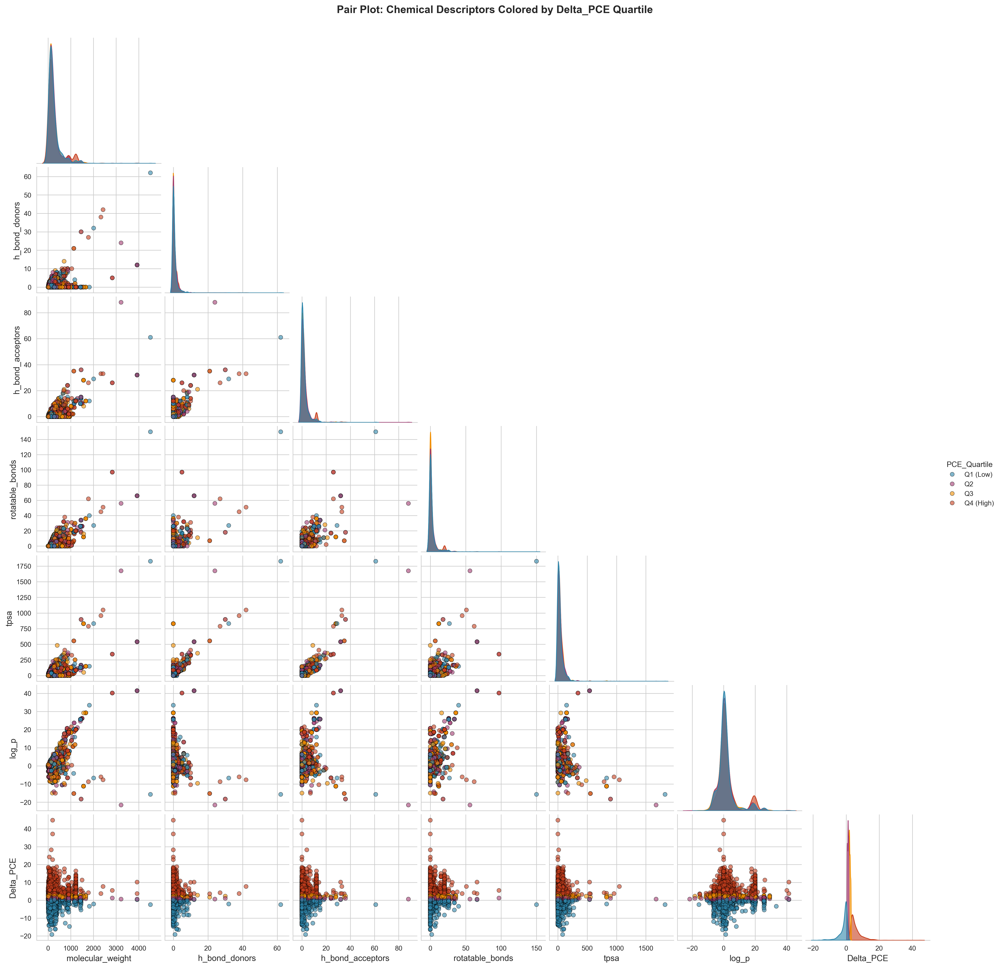

*图16. 所有描述符的配对图矩阵，按Delta_PCE四分位数着色*

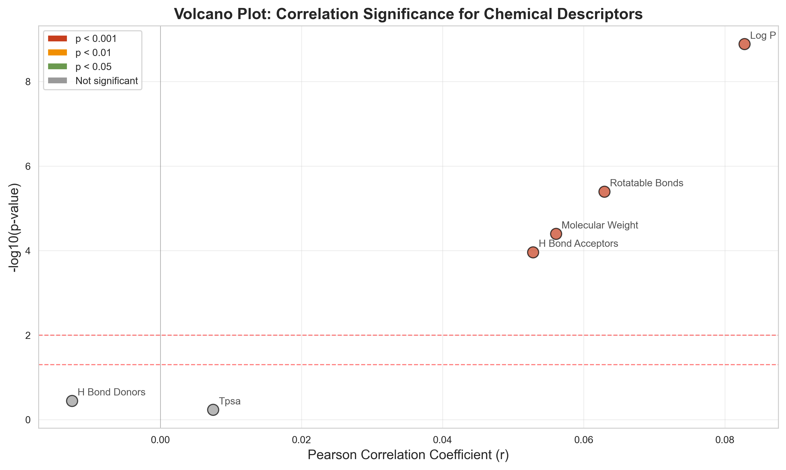

*图17. 相关强度与统计显著性的火山图*

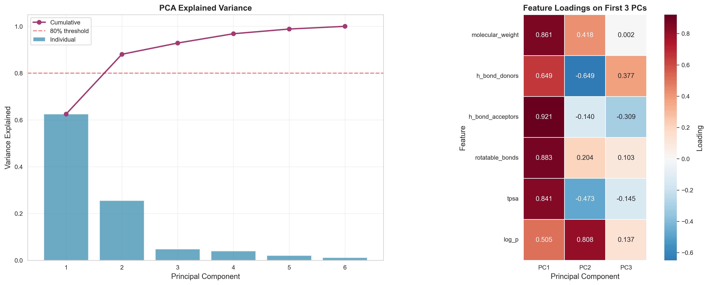

*图18. PCA方差解释和特征载荷*

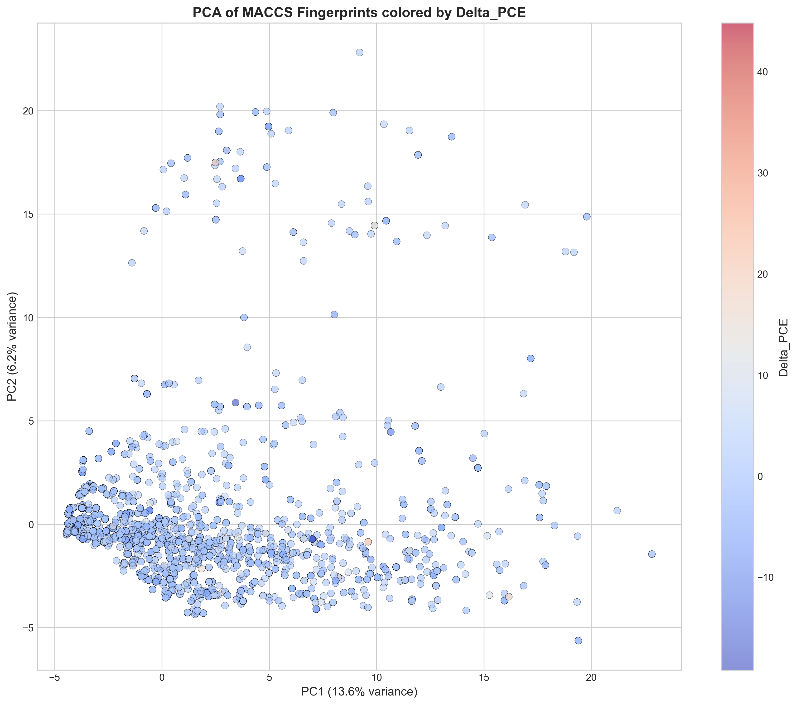

*图19. MACCS指纹的PCA投影*

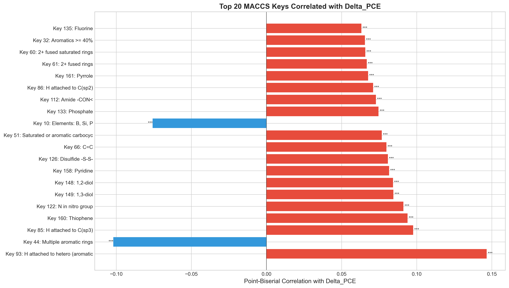

*图20. 与Delta_PCE最相关的前20个MACCS键*

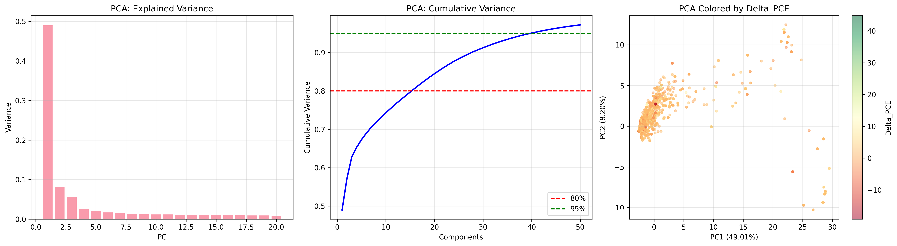

*图21. Klekota-Roth指纹的PCA分析*

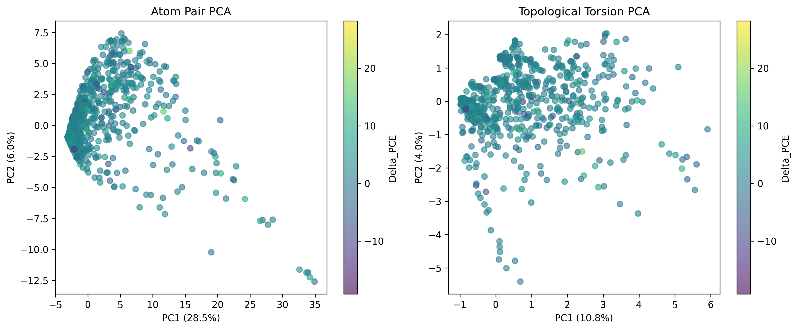

*图22. 原子对和拓扑扭转指纹的PCA散点图*

### AutoGluon机器学习图表

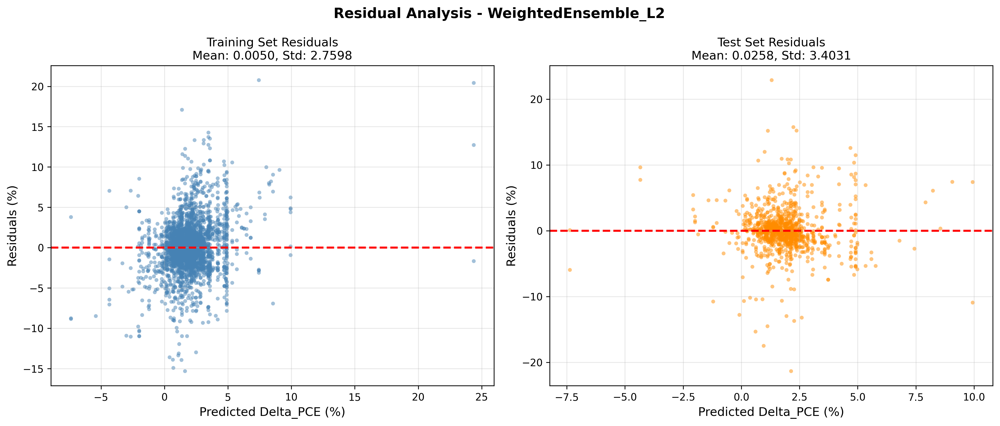

*图23. AutoGluon最优模型的训练集和测试集残差分析*

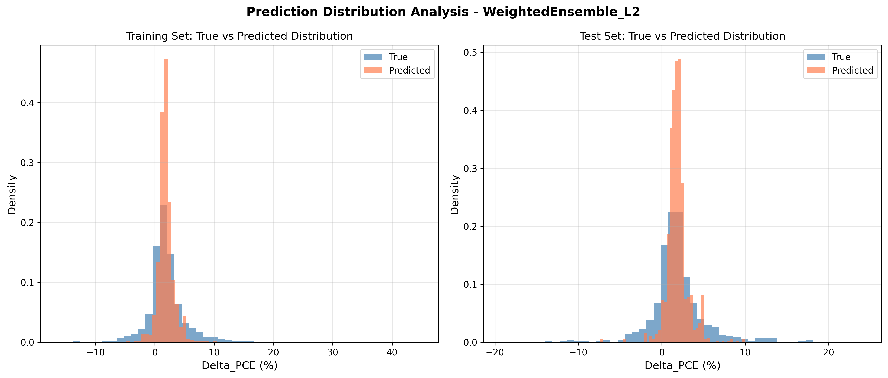

*图24. AutoGluon模型的预测分布与真实分布对比*

---

## 附录：数据可用性

### 数据文件
- **处理后数据集**: `/share/yhm/test/AutoML_EDA/processed_data.csv`
- **统计表格**: `/share/yhm/test/AutoML_EDA/tables/`
- **所有图表**: `/share/yhm/test/AutoML_EDA/figures/`
- **指纹数据**: `/share/yhm/test/AutoML_EDA/fingerprints/`
- **交互式仪表板**: `/share/yhm/test/AutoML_EDA/dashboard.html`

### AutoGluon模型文件
- **AutoGluon模型目录**: `/share/yhm/test/AutoML_EDA/autogluon_models/`
- **模型排行榜**: `/share/yhm/test/AutoML_EDA/tables/autogluon_leaderboard.csv`
- **特征重要性**: `/share/yhm/test/AutoML_EDA/tables/autogluon_feature_importance.csv`
- **详细ML报告**: `/share/yhm/test/AutoML_EDA/autogluon_ml_report.md`

---

**分析日期**: 2026年3月5日 (更新)

**分析框架**: ML-Master启发的AutoML方法 + AutoGluon优化

**AutoGluon优化目标**: 5折交叉验证R²

**最优模型**: WeightedEnsemble_L2 (CV R² = 0.1624)

---

*本报告由自动化分析系统生成。所有统计解释应由领域专家验证后再得出科学结论。*
